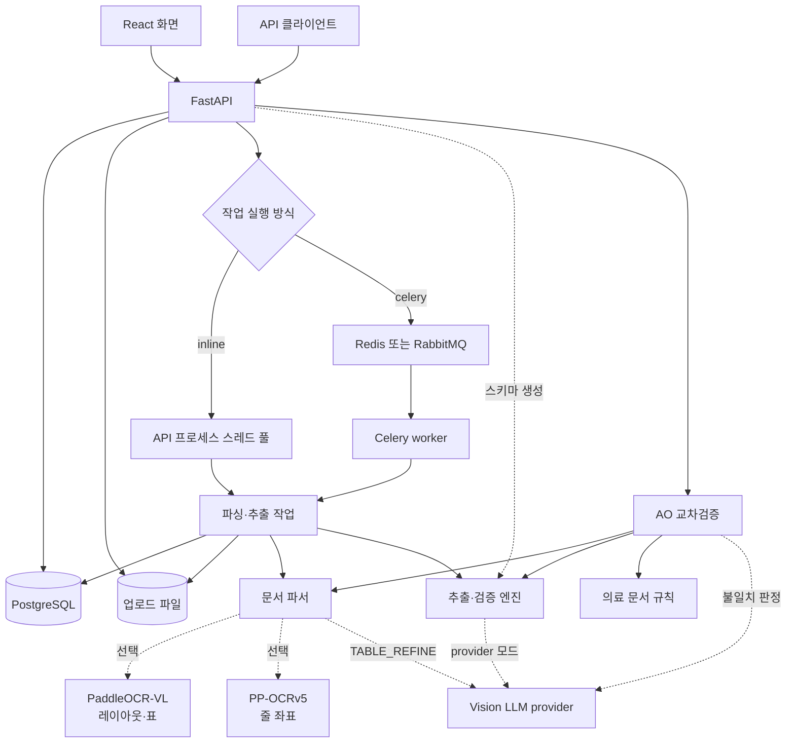
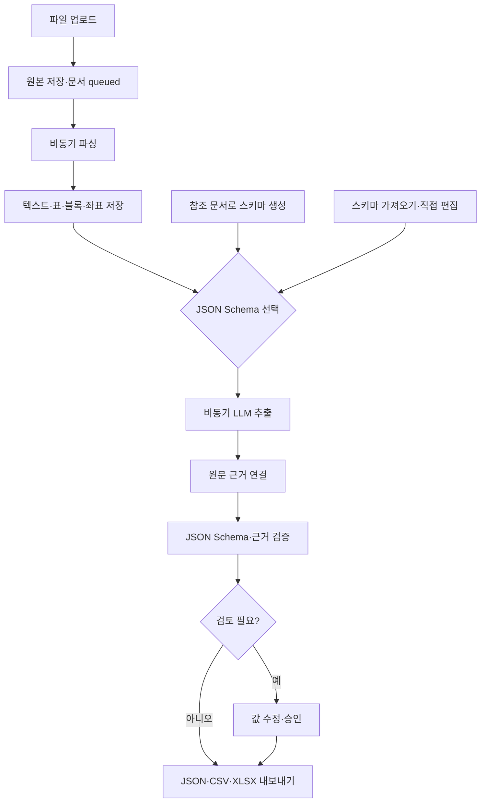
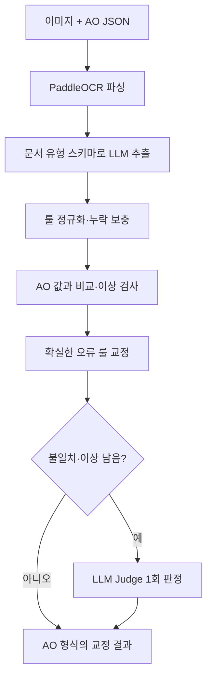

# Docraft

Docraft는 문서를 파싱하고 JSON Schema에 맞춰 값을 추출한 뒤, 원문 근거와 검토 결과를 제공하는 웹 앱입니다. 별도의 `POST /api/verify`는 Agentic OCR 2.0(AO)의 의료 문서 결과를 독립 추출 결과와 비교해 교정합니다.

## 구조



일반 프로젝트의 파싱·추출은 작업 큐에서 비동기로 실행합니다. `verify`는 요청 중 파싱, 추출, 판정을 마친 뒤 응답하며 프로젝트 문서나 작업 큐에 저장하지 않습니다. PostgreSQL은 프로젝트·스키마·상태·결과를, `DOCRAFT_DATA_DIR`은 업로드 원본을 저장합니다.

## 빠른 시작

Python 3.11 이상, Node.js 20 이상, Docker Compose가 필요합니다. 저장소 루트에서 실행합니다.

```bash
docker compose up -d
python3 -m venv .venv
source .venv/bin/activate
pip install -r requirements-dev.txt
cp .env.example .env
uvicorn backend.main:app --reload
```

다른 터미널에서 화면을 실행합니다.

```bash
cd frontend
npm install
npm run dev
```

화면: `http://localhost:5173` · API: `http://127.0.0.1:8000` · API 명세: `http://127.0.0.1:8000/docs`. 기본 DB는 Compose의 PostgreSQL(`127.0.0.1:5433`)입니다. `.env`에서 AI와 OCR 서비스를 설정해야 관련 기능을 사용할 수 있습니다. `AI_MODE=local`은 개발용 휴리스틱 추출이고, provider 사용 시 `AI_BASE_URL`·`AI_API_KEY`·`AI_VLM_MODEL`을 설정합니다.

전체 스택은 `docker compose --profile app up -d --build`로 실행할 수 있습니다(화면 `:3000`). GPU OCR까지 실행하려면 `--profile ocr`를 추가합니다. Docker에서는 nginx가 `/api`를 backend로 전달하며, DB·파일 경로·OCR 주소는 Compose 내부 주소로 설정됩니다. 로컬 서버와 Docker backend의 기본 포트 `8000`은 겹치므로 동시에 띄울 때는 `BACKEND_PORT`를 바꿉니다. [AWS 개발 서버 배포 절차](deploy/aws/README.md)도 제공합니다.

## 문서 추출 흐름



1. 프로젝트에 PDF, 이미지, DOCX, XLSX, CSV, TXT, Markdown, HTML 문서를 업로드합니다. 파서와 PDF 페이지 범위·표 형식을 선택해 다시 분석할 수 있습니다.
2. `01 문서 분석`에서 블록별 파싱 결과와 원문 위치를 확인합니다. PaddleOCR-VL을 연결하면 이미지·스캔 PDF와 표를 분석합니다. 선택적인 PP-OCRv5 서비스는 줄 단위 근거 좌표를 더합니다.
3. `02 스키마 설계`에서 참고 문서로 스키마를 생성하거나 JSON Schema를 가져오고 편집합니다. 스키마는 프로젝트에 버전별로 저장됩니다.
4. `03 데이터 추출`에서 스키마를 골라 추출합니다. provider 모드에서는 OCR 텍스트와, `AI_VISION=true`인 PDF·이미지의 페이지 이미지를 LLM에 보냅니다. 긴 문서는 페이지 경계를 기준으로 나눠 추출합니다. 낮은 신뢰도나 검증 문제를 검토한 뒤 값 수정·승인·내보내기를 진행합니다. `결과 표`에서는 여러 문서의 값을 비교하고 일괄 추출합니다.

일반 추출에는 **프로젝트에 저장한 JSON Schema**를 사용합니다. 스키마의 key·자료형·설명·enum과 원문 블록을 전달하면 LLM이 value를 채워 반환합니다. provider 요청은 JSON 객체 응답(`response_format: json_object`)을 요구합니다. JSON Schema는 추출 지시로 전달하고 반환값은 서버에서 검증하며, provider의 strict schema 응답 모드는 사용하지 않습니다. provider 오류를 로컬 추출 결과로 자동 대체하지 않습니다.

## AO 결과 교차검증

`POST /api/verify`는 단일 페이지 이미지(PNG·JPG·JPEG·TIF·TIFF·WebP)와 AO 응답 JSON을 받습니다. 지원 문서 유형은 진단서·소견서·진료비영수증·세부내역서입니다. 일반 프로젝트 스키마와 달리 이 경로의 필드 키·자료형·설명은 [`backend/doctypes.py`](backend/doctypes.py)에 정의되어 있습니다. [`backend/rules.py`](backend/rules.py)의 라벨 동의어·정규화·파생값·표 검사는 twin reader 규칙을 코드로 이식한 것이며, 실행 중 twin reader 확장을 읽지는 않습니다.



Judge에는 남은 불일치와 이상만 전달합니다. 결과는 입력 AO 구조를 유지하며 값별 `ao_value`, `docraft_value`, `source`, `reason`을 붙이고, `verify`에 유형·건수·검사 결과를 담습니다. AO에 없던 필드는 `added: true`로 추가될 수 있습니다. `ao_result`는 JSON **문자열** form 필드입니다.

```bash
curl -X POST http://127.0.0.1:8000/api/verify \
  -F 'image=@document.tif' \
  -F 'ao_result=<ao_response.json' \
  -F 'doc_type=진료비영수증'
```

`DOCRAFT_API_KEY`를 설정한 경우 `-H "X-API-Key: $DOCRAFT_API_KEY"`를 추가합니다. API/UI 형식 AO 응답을 지원합니다. 검증 설계와 평가 기록은 [AO 교차검증 문서](wiki/2026-09-22-ocr-verify.md)를 참고하세요.

## 주요 API

| 기능 | 경로 |
| --- | --- |
| 프로젝트 생성·조회 | `POST /api/projects`, `GET /api/projects/{project_id}` |
| 문서 업로드·조회·재파싱 | `POST /api/projects/{project_id}/documents`, `GET /api/documents/{document_id}`, `POST /api/documents/{document_id}/parse` |
| 스키마 생성·저장 | `POST /api/projects/{project_id}/schemas/generate`, `POST /api/projects/{project_id}/schemas` |
| 단건·일괄 추출 | `POST /api/documents/{document_id}/extract`, `POST /api/projects/{project_id}/extract` |
| 값 수정·승인 | `PATCH /api/documents/{document_id}/review`, `POST /api/documents/{document_id}/approve` |
| 결과 내보내기 | `GET /api/documents/{document_id}/export`, `GET /api/projects/{project_id}/export` |
| AO 교차검증 | `POST /api/verify` |

업로드·재파싱·추출은 `202`로 접수하며, 문서 조회의 상태(`queued`, `parsing`, `parsed`, `extracting`, `validating`, `needs_review`, `completed`, `failed`)에서 진행 상황을 확인합니다. 교차검증은 동기 응답입니다. 정확한 요청·응답은 실행 중인 `/docs`를 따릅니다.

## 설정과 운영

| 변수 | 기본값 | 용도 |
| --- | --- | --- |
| `DATABASE_URL`, `DOCRAFT_DATA_DIR` | `.env.example` 참고 | PostgreSQL 연결·원본 저장 |
| `DOCRAFT_API_KEY` | 빈 값 | 설정 시 `X-API-Key` 인증 활성화 |
| `AI_MODE`, `AI_BASE_URL`, `AI_API_KEY`, `AI_VLM_MODEL` | `provider`, 빈 URL·키 | 추출·스키마 생성 provider 설정 |
| `AI_VISION` | `true` | PDF·이미지의 페이지 이미지를 provider에 첨부 |
| `PARSE_PROVIDER`, `PADDLEOCR_BASE_URL` | `library`, 빈 URL | 기본 라이브러리 파싱 또는 원격 PaddleOCR |
| `PADDLEOCR_LINES_URL` | 빈 값 | 선택적인 줄 단위 근거 좌표 |
| `TABLE_REFINE` | `false` | OCR 표 셀 텍스트를 LLM으로 추가 교정 |
| `QUEUE_BACKEND`, `QUEUE_CONCURRENCY` | `inline`, `2` | 프로세스 스레드 풀 또는 Celery 작업 큐 |
| `LOG_LEVEL`, `LOG_FILE` | `DEBUG`, 저장소 `docraft.log` | 로그 수준·파일 위치; 빈 `LOG_FILE`은 파일 기록 중단 |

`.env.example`을 복사해 값을 설정합니다. `.env` 탐색 순서는 `DOCRAFT_ENV_FILE` → 현재 디렉터리 → 저장소 → worktree 원본 저장소이며, 처음 찾은 파일만 읽고 기존 환경변수는 유지합니다. 화면의 `API 키 설정`에는 `DOCRAFT_API_KEY`를 입력하고, 모델 provider의 `AI_API_KEY`는 서버에서만 사용합니다. `PARSE_PROVIDER=library`는 스캔 이미지 OCR을 제공하지 않습니다. 로컬 GPU OCR은 `docker compose --profile ocr up -d` 후 `PARSE_PROVIDER=paddle`, `PADDLEOCR_BASE_URL=http://127.0.0.1:8080`으로 연결합니다. 줄 좌표 서비스는 같은 profile의 `http://127.0.0.1:8081`을 `PADDLEOCR_LINES_URL`에 지정합니다. 표 OCR 셀 교정과 페이지 이미지 첨부는 provider에 문서 이미지를 전송합니다. 관련 구성은 [PaddleOCR 호환성](wiki/2026-09-21-paddleocr-compatibility.md), [줄 좌표](wiki/2026-09-22-ocr-line-grounding.md), [표 교정](wiki/2026-09-22-table-refine.md)에 기록되어 있습니다.

Celery를 쓰려면 `pip install -r requirements-queue.txt` 후 `QUEUE_BACKEND=celery`, `CELERY_BROKER_URL`을 설정하고 `python -m backend.worker`를 실행합니다. Compose에서는 `QUEUE_BACKEND=celery docker compose --profile app --profile queue up -d --build`를 사용할 수 있습니다. worker는 API와 같은 DB·업로드 파일을 볼 수 있어야 합니다. [작업 큐 설계](wiki/2026-09-22-job-queue.md)에 복구·lease 동작이 설명되어 있습니다.

설정 예시(OpenRouter + 로컬 OCR):

```dotenv
AI_MODE=provider
AI_BASE_URL=https://openrouter.ai/api/v1
AI_API_KEY=<provider-key>
AI_VLM_MODEL=qwen/qwen3-vl-32b-instruct
PARSE_PROVIDER=paddle
PADDLEOCR_BASE_URL=http://127.0.0.1:8080
```

## 개발 확인

```bash
pytest -q
cd frontend && npm run build
```

테스트는 PostgreSQL의 격리된 schema를 사용합니다. 자세한 구현·검증 기록은 [wiki/index.md](wiki/index.md)에서 찾을 수 있습니다.
