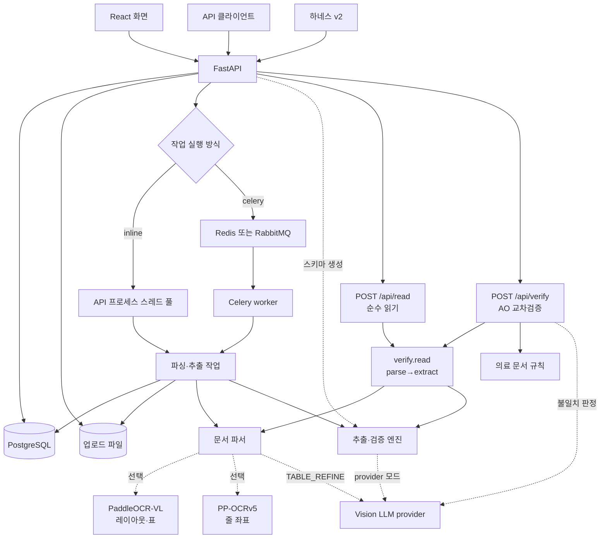
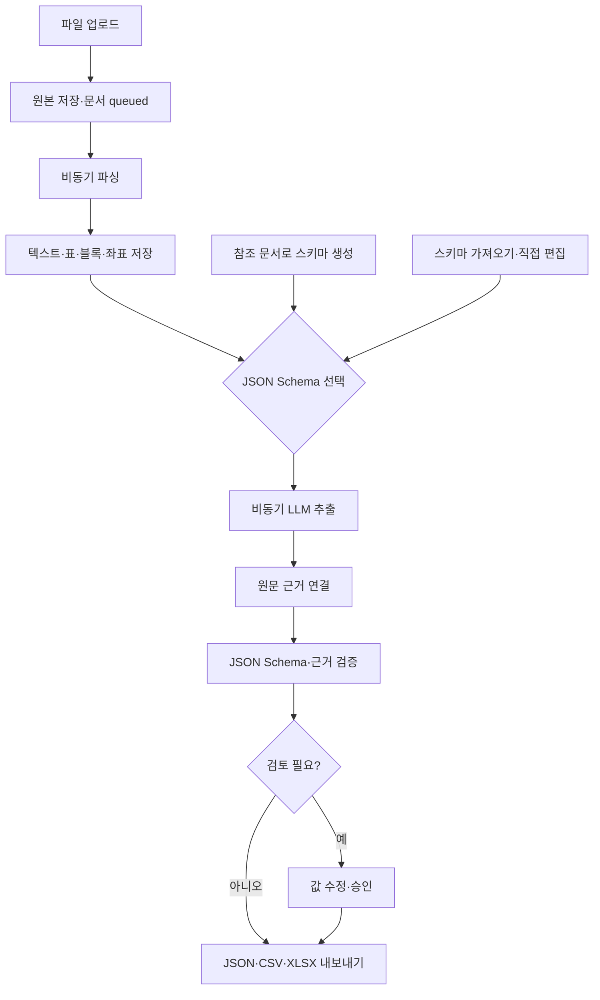
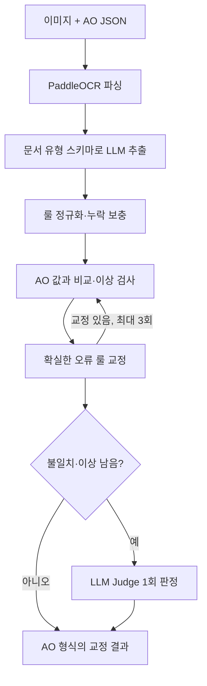

# Docraft

Docraft는 문서를 파싱하고 JSON Schema에 맞춰 값을 추출한 뒤, 원문 근거와 검토 결과를 제공하는 웹 앱입니다. 별도의 `POST /api/verify`는 Agentic OCR 2.0(AO)의 의료 문서 결과를 독립 추출 결과와 비교해 교정합니다.

하네스(harness-v2)와의 역할 분담은 "판단은 하네스, 읽기는 Docraft"입니다. `POST /api/read`는 Docraft 자신의 추출 결과만(AO 비교·교정·Judge 없이) 돌려주는 순수 읽기 API로, 하네스가 **두 경우에만** 씁니다 — 서식이 잘못 분류됐을 때의 전체 재추출과, 결과가 애매한 문서의 검토 칸 재조회(한 건에 최대 2번, 2026-09-27). 하네스는 더 이상 `/api/verify`를 부르지 않으며, `POST /api/verify`는 Docraft 단독 사용·화면에만 남아 있습니다(하네스가 부르던 예전 경로였던 이력은 있으나 지금은 호출하지 않습니다). 두 경로 모두 파싱과 스키마 추출은 같은 코드(`verify.read`)를 공유합니다.

## 구조


```mermaid
flowchart TD
    UI[React 화면] --> API[FastAPI]
    Client[API 클라이언트] --> API
    API --> DB[(PostgreSQL)]
    API --> Files[(업로드 파일)]
    API --> Queue{작업 실행 방식}
    Queue -- inline --> Thread[API 프로세스 스레드 풀]
    Queue -- celery --> Broker[Redis 또는 RabbitMQ]
    Broker --> Worker[Celery worker]
    Thread --> Jobs[파싱·추출 작업]
    Worker --> Jobs
    Jobs --> DB
    Jobs --> Files
    Jobs --> Parser[문서 파서]
    Jobs --> Engine[추출·검증 엔진]
    Parser -. 선택 .-> OCR[PaddleOCR-VL<br/>레이아웃·표]
    Parser -. 선택 .-> Lines[PP-OCRv5<br/>줄 좌표]
    Engine -. provider 모드 .-> LLM[Vision LLM provider]
    Parser -. TABLE_REFINE .-> LLM
    API -. 스키마 생성 .-> Engine
    Harness[하네스 v2] --> API
    API --> Read[POST /api/read<br/>순수 읽기]
    API --> Verify[POST /api/verify<br/>AO 교차검증]
    Read --> Shared[verify.read<br/>parse→extract]
    Verify --> Shared
    Shared --> Parser
    Shared --> Engine
    Verify --> Rules[의료 문서 규칙]
    Verify -. 불일치 판정 .-> LLM
```

일반 프로젝트의 파싱·추출은 작업 큐에서 비동기로 실행합니다. `read`·`verify`는 요청 중 파싱·추출(과 `verify`는 판정까지)을 마친 뒤 응답하며 프로젝트 문서나 작업 큐에 저장하지 않습니다. PostgreSQL은 프로젝트·스키마·상태·결과를, `DOCRAFT_DATA_DIR`은 업로드 원본을 저장합니다.

## 빠른 시작

Python 3.11 이상, Node.js 20 이상, Docker Compose가 필요합니다. 저장소 루트에서 실행합니다.

```bash
docker compose up -d
python3 -m venv .venv
source .venv/bin/activate
pip install -r requirements-dev.txt
cp .env.example .env
uvicorn backend.main:app --reload
```

다른 터미널에서 화면을 실행합니다.

```bash
cd frontend
npm install
npm run dev
```

화면: `http://localhost:5173` · API: `http://127.0.0.1:8000` · API 명세: `http://127.0.0.1:8000/docs`. 기본 DB는 Compose의 PostgreSQL(`127.0.0.1:5433`)입니다. `.env`에서 AI와 OCR 서비스를 설정해야 관련 기능을 사용할 수 있습니다. `AI_MODE=local`은 개발용 휴리스틱 추출이고, provider 사용 시 `AI_BASE_URL`·`AI_API_KEY`·`AI_VLM_MODEL`을 설정합니다.

전체 스택은 `docker compose --profile app up -d --build`로 실행할 수 있습니다(화면 `:3000`). GPU OCR까지 실행하려면 `--profile ocr`를 추가합니다. Docker에서는 nginx가 `/api`를 backend로 전달하며(긴 세부내역서 교차검증을 위해 프록시 시간 제한 900초), DB·파일 경로·OCR 주소는 Compose 내부 주소로 설정됩니다. 로컬 서버와 Docker backend의 기본 포트 `8000`은 겹치므로 동시에 띄울 때는 `BACKEND_PORT`를 바꿉니다. [AWS 개발 서버 배포 절차](deploy/aws/README.md)도 제공합니다.

고객 폐쇄망 k8s 배포용 Helm 차트는 [deploy/k8s/helm/docraft](deploy/k8s/helm/docraft)에 있습니다(harness-installer 우산 차트의 서브차트 전제, Postgres·Redis는 harness-v2 것을 공유). 값·GPU 배치·hostPath 모델 구조는 [deploy/k8s/README.md](deploy/k8s/README.md)를 참고하세요.

## 문서 추출 흐름


```mermaid
flowchart TD
    Upload[파일 업로드] --> Save[원본 저장·문서 queued]
    Save --> Parse[비동기 파싱]
    Parse --> Parsed[텍스트·표·블록·좌표 저장]
    Parsed --> Schema{JSON Schema 선택}
    Generate[참조 문서로 스키마 생성] --> Schema
    Import[스키마 가져오기·직접 편집] --> Schema
    Schema --> Extract[비동기 LLM 추출]
    Extract --> Ground[원문 근거 연결]
    Ground --> Validate[JSON Schema·근거 검증]
    Validate --> Review{검토 필요?}
    Review -- 예 --> Edit[값 수정·승인]
    Review -- 아니오 --> Export[JSON·CSV·XLSX 내보내기]
    Edit --> Export
```

1. 프로젝트에 PDF, 이미지, DOCX, XLSX, CSV, TXT, Markdown, HTML 문서를 업로드합니다. 파서와 PDF 페이지 범위·표 형식을 선택해 다시 분석할 수 있습니다.
2. `01 문서 분석`에서 블록별 파싱 결과와 원문 위치를 확인합니다. PaddleOCR-VL을 연결하면 이미지·스캔 PDF와 표를 분석합니다. 선택적인 PP-OCRv5 서비스는 줄 단위 근거 좌표를 더합니다. 괘선이 인쇄된 표는 모델이 생성한 HTML 대신 인쇄된 괘선에서 행·열·병합을 복원하며, 표 영역의 기울기를 먼저 펴고 이미지 해상도에 맞춰 괘선을 찾습니다([표 복원](wiki/2026-09-22-table-restore.md)).
3. `02 스키마 설계`에서 참고 문서로 스키마를 생성하거나 JSON Schema를 가져오고 편집합니다. 스키마는 프로젝트에 버전별로 저장됩니다.
4. `03 데이터 추출`에서 스키마를 골라 추출합니다. provider 모드에서는 OCR 텍스트와, `AI_VISION=true`인 PDF·이미지의 페이지 이미지를 LLM에 보냅니다. 긴 문서는 페이지 경계를 기준으로 나눠 추출합니다. 낮은 신뢰도나 검증 문제를 검토한 뒤 값 수정·승인·내보내기를 진행합니다. `결과 표`에서는 여러 문서의 값을 비교하고 일괄 추출합니다.

일반 추출에는 **프로젝트에 저장한 JSON Schema**를 사용합니다. 스키마의 key·자료형·설명·enum과 원문 블록을 전달하면 LLM이 value를 채워 반환합니다. provider 요청은 JSON 객체 응답(`response_format: json_object`)을 요구합니다. JSON Schema는 추출 지시로 전달하고 반환값은 서버에서 검증하며, provider의 strict schema 응답 모드는 사용하지 않습니다. provider 오류를 로컬 추출 결과로 자동 대체하지 않습니다.

## 하네스용 읽기 전용 API

`POST /api/read`는 Docraft를 하네스(harness-v2)의 **읽기 서비스**로 쓰는 경로입니다 — 판단(비교·재분류·최종 채택)은 하네스가 하고, Docraft는 이미지를 읽어 값만 돌려줍니다. AO 비교·교정·`rules.run`·Judge는 전혀 거치지 않습니다. 하네스는 이 경로를 **두 경우에만** 부릅니다 — 재분류 재추출(제목 줄로 본 서식이 AO 분류와 스키마 계열부터 다를 때, `keys` 없이 전체)과 검토 칸 재조회(문서 등급이 애매·미해결일 때 검토 칸만, 예전에는 `/api/verify`가 하던 역할). 문서마다 부르던 재읽기와 bbox 크롭 자기 교정도 한때 이 경로로 연결했지만, AWS 실측에서 느리고(한 번 13~37초, 큰 표 100~180초) 크롭 교정이 해결한 칸이 없어(8칸 중 0) 하네스 쪽에서 껐습니다 — 하네스 설정으로 다시 켤 수 있어 크롭 이미지도 계속 받습니다. 이미지가 실린 비동기 경로(`/v2/jobs`)에서만 쓰며, 동기·배치 경로는 Docraft를 부르지 않습니다.

- `image`: 단일 페이지 이미지 파일. `/api/verify`와 같은 허용 확장자·다중 페이지 검사(422)를 씁니다. 페이지의 일부를 잘라낸 크롭 이미지도 받습니다.
- `doc_type`: 필수 문자열. `/api/verify`와 같은 별칭(`doctypes.ALIASES`)으로 정규화하며, 모르는 유형이면 422입니다.
- `keys`: 선택 JSON 배열 문자열(예: `["병원명", "항목내역"]`). 그 유형의 필드·표 key만 추출합니다(추출 스키마도 그만큼 좁혀 비용을 줄입니다). 정의에 없는 key는 무시하고 한 번 경고 로그를 남기며, 유효한 key가 하나도 없으면 읽지 않고 빈 `fields`(200)를 돌려줍니다 — 하네스 검토 칸이 모두 Docraft 정의 밖일 때(사고발생일자 등)입니다. 생략하면 유형의 전체 필드를 돌려줍니다.

응답은 `{"doc_type": "<정규화된 유형>", "fields": {"<key>": <값 또는 행 dict 목록>, ...}, "elapsed_ms": <정수>}`입니다. `fields`는 `verify.run`이 쓰는 것과 같은 파싱→추출(요청한 key로 좁힌 스키마)→`rules.apply`를 거친 Docraft의 읽기 그대로이며(요청한 key가 있으면 그 key만), AO 비교·판정 정보(`source`·`reason` 등)는 붙지 않습니다. 클라이언트 연결이 끊기면 `/api/verify`와 같은 방식으로 추출 전에 멈추고 499를 돌려주며, `/api/health`의 `verify_inflight`가 `/api/verify`·`/api/read` 처리 중 요청 수를 함께 셉니다. 오류는 `/api/verify`와 같이 `ValueError`(파싱 오류 포함)는 422, 그 외는 502입니다.

여기서 쓰는 VLM은 `/api/verify`·일반 추출과 같은 `engine.extract` 설정(`AI_BASE_URL` 등)을 그대로 씁니다 — 하네스는 VLM을 직접 부르지 않고 항상 이 API를 거칩니다. AWS 개발 서버는 OpenRouter(`qwen/qwen3-vl-32b-instruct`)를, 고객사 온프레미스 k8s는 같은 추출 모델을 자체 호스팅한 Qwen3-VL(vLLM)을 씁니다.

```bash
curl -X POST http://127.0.0.1:8000/api/read \
  -F 'image=@crop.png' \
  -F 'doc_type=진료비영수증' \
  -F 'keys=["항목내역"]'
```

`POST /api/verify`는 Docraft 단독 사용(화면)에만 남아 있고, 하네스는 더 이상 이 경로를 부르지 않습니다(예전에는 하네스의 폴백 경로였습니다). `/api/read`와 파싱·추출은 같은 함수(`verify.read`)를 공유하므로 구현이 갈라지지 않습니다.

## AO 결과 교차검증

`POST /api/verify`는 단일 페이지 이미지(PNG·JPG·JPEG·TIF·TIFF·WebP)와 AO 응답 JSON을 받습니다. 지원 문서 유형은 진단서·소견서·수술확인서·입퇴원확인서·진료비영수증·세부내역서·약제비영수증 7종입니다(AO가 내는 `입원확인서`·`약제영수증`도 받습니다). 일반 프로젝트 스키마와 달리 이 경로의 필드 키·자료형·설명은 [`backend/doctypes.py`](backend/doctypes.py)에 정의되어 있습니다. [`backend/rules.py`](backend/rules.py)의 라벨 동의어·정규화·파생값·표 검사는 twin reader 규칙을 코드로 이식한 것이며, 실행 중 twin reader 확장을 읽지는 않습니다.


```mermaid
flowchart TD
    Input[이미지 + AO JSON] --> Parse[PaddleOCR 파싱]
    Parse --> LLM[문서 유형 스키마로 LLM 추출]
    LLM --> Rules[룰 정규화·누락 보충]
    Rules --> Check[AO 값과 비교·이상 검사]
    Check --> Fix[확실한 오류 룰 교정]
    Fix -- 교정 있음, 최대 3회 --> Check
    Fix --> Diff{불일치·이상 남음?}
    Diff -- 예 --> Judge[LLM Judge 1회 판정]
    Diff -- 아니오 --> Output[AO 형식의 교정 결과]
    Judge --> Output
```

표는 행 순서·개수가 아니라 행 식별 열(세부내역서 `항목`+`EDI코드`+`시작일자`, 진료비영수증 `항목`, 진단서류 `병명코드`·`수술일자` 등)로 행을 대응시켜 비교합니다. 대응된 행은 어긋난 셀만, 대응되지 않은 행만 행 단위로 Judge에 알립니다. 키가 같은 행이 여럿이면(같은 날 `이학요법료` 여러 행 등) 나머지 칸이 더 많이 같은 행과 잇습니다. 이 키 정의(`rules.ROW_KEYS`)와 짝짓기(`rules.pair_rows`)는 교차검증과 정확도 채점이 함께 씁니다. 세부내역서처럼 Docraft가 집계 행을 뽑지 않는 유형은 AO의 인쇄된 소계·계·합계 행을 비교·판정에서 빼 두었다가 최종 표의 원래 자리에 그대로 되돌립니다(`verify._with_totals`).

룰 검사(`rules.check`)는 표 금액 셀의 겹침·서식에 없는 열(묶음 제목, 파서 머리글에 없는 열)·항목명 규칙과 한 글자 오독(`item_name`)·합계 베끼기·행 누락과 과다·합계식 불일치(`sum_mismatch`)·이웃 열 밀림(`column_shift`)·세로 행 밀림(`row_shift`)·행 산술(`row_arith`)·세부내역서 급여구분 값(`item_class`, AO의 `열추출` 등)·병실 칸의 진료과(`ward`)·EDI명칭을 베낀 항목(`section_item`)·AO가 비운 단가·투여량 칸(`empty_cell`)·날짜 선후(`bad_date`)·주민번호 불일치(`id_mismatch`)·인쇄되지 않은 합계(`ungrounded`)·저품질 문서(`low_quality`)·마스터에 없는 병명코드를 찾습니다. 그중 확실한 것(항목명 표준화, 금액 열로 정해지는 급여구분(본인·공단·전액본인부담만 있으면 급여, 비급여만 있으면 비급여), 금액 0인 누락 행, Docraft가 읽은 열로 옮기는 열 밀림(없는 열 포함), 파서 표로 확인된 행 밀림, 통째로 맞바뀐 열, 인쇄되지 않은 세부내역서 급여 합계, 병실의 진료과 비우기, 섹션 제목 항목, Docraft가 읽은 단가·투여량 칸)만 룰로 교정하고 나머지는 Judge 힌트로 넘깁니다. Judge가 고친 표에서도 AO와 Docraft가 같게 읽은 칸은 그 값을 유지합니다. 검사와 교정은 `rules.run`이 교정할 것이 없어질 때까지 최대 3회 반복합니다. 각 검사는 `rules.RULES`에 룰 id(`RECEIPT.ROW_SHIFT` 등)·category·실패 시 조치(`CORRECT`·`RE_EXTRACT`·`ESCALATE`)·교정 순서와 함께 등록되어 있습니다. 라운드별 룰 결과는 `verify.trace`에 남고, 끝까지 풀리지 않은 `ESCALATE` 룰 이상이 걸린 값에는 `review: true`가 붙습니다. 자동 통과시키지 않을 칸에도 `review: true`가 붙습니다(`verify.mark_review`): AO와 Docraft가 다르게 읽은 칸(Judge가 골랐어도, 구두점 한 글자 차이도), 최종값에 남은 계산·구조 이상(CALC·STRUCT 룰, 예: 합계식 불일치·행 누락·모든 행이 빈 인쇄 열)이 가리키는 행·열이며, 행을 가리키지 않는 표 이상은 표 원소에도 붙습니다. 문서별 판정 칸 수와 검토 칸 수는 `verify.review`에 있습니다. 라벨 동의어·합계식·날짜 선후 같은 룰 데이터 표는 [`backend/rulesets/rules.yaml`](backend/rulesets/rules.yaml)에 있고, `required`에 유형별 필수 필드(AO에서 비어 있으면 Judge가 다시 보고, 끝까지 비면 `review: true`)를, `disable`에 유형별로 끌 룰 id를 적을 수 있습니다(모르는 키나 룰 id가 있으면 서버가 뜨지 않습니다). 진료비영수증 항목명 별칭·표준 항목·열 맞바꿈 표(`item_aliases`·`receipt_item_names`·`swaps`)만은 [`backend/rulesets/shared/receipt_items.yaml`](backend/rulesets/shared/receipt_items.yaml)에 따로 있습니다 — 하네스(`src/mlife_harness/rulesets/shared/receipt_items.yaml`)가 이 값들을 그대로 이식한 바이트가 같은 사본을 쓰기 때문이며(harness-installer의 `build-bundle.sh`가 빌드 전에 두 파일을 `cmp`로 확인), 고칠 때는 두 저장소에 함께 반영해야 합니다. 설계는 [룰 엔진 설계안](wiki/2026-09-23-rule-engine-design.md)에 있습니다. 유형별 엣지케이스와 효과는 [룰 엣지케이스 기록](wiki/2026-09-23-rules-edge-cases.md)에 있습니다.

추출 프롬프트에는 표 **근거 제약**을 함께 보냅니다. 문서에 인쇄된 행만 인쇄 순서대로 내고, 인쇄되지 않은 표준 항목 행을 덧붙이지 않으며, 인쇄된 이름이 표준 목록에 없어도 비슷한 표준 이름으로 바꾸지 않습니다(`doctypes.GROUND_HINT`는 영수증·세부내역서 표 설명에, `engine.TABLE_NOTE`는 표가 있는 스키마의 system 지침에 붙습니다). 전후 수치는 [근거 제약 기록](wiki/2026-09-22-extract-grounding.md)에 있습니다.

Judge에는 남은 불일치와 이상만 전달합니다. Judge 판정이 합계식(`rules.sum_errors`)을 더 어기면 key를 하나씩 AO·Docraft 값으로 바꿔 보고 불일치가 줄어드는 값을 택합니다(흐린 숫자 오독 대비, 빈 값으로는 바꾸지 않음). 결과는 입력 AO 구조를 유지하며 값별 `ao_value`, `docraft_value`, `source`, `reason`을 붙이고(`predicted_value`도 최종값으로 맞추며 AO 원래 값은 `ao_value`에 남습니다. 표 셀은 행 짝짓기로 원래 셀을 찾아 붙입니다), `verify`에 유형·건수·검사 결과를 담습니다. AO에 없던 필드는 `added: true`로 추가될 수 있습니다. `ao_result`는 JSON **문자열** form 필드입니다. 처리 중에 클라이언트 연결이 끊기면 추출·Judge 호출 전에 멈추고 499를 돌려주며, `/api/health`의 `verify_inflight`로 처리 중인 건수(`/api/read`와 합계)를 볼 수 있습니다. 교차검증은 이벤트 루프 밖 스레드에서 돌아 여러 건을 동시에 보낼 수 있습니다(AWS L4 기준 영수증 약 1~2분, 세부내역서 1~5분).

선택 필드 `hint_paths`(JSON 배열 문자열, 예: `["병원명", "항목내역"]`)를 주면 그 필드·표 key만 비교·Judge 대상으로 삼아 비용을 줄입니다(룰 엔진이 이미 확정한 필드는 다시 보내지 않는 용도). 힌트에 없는 필드는 AO 값 그대로 돌아가며 `source` 등 판정 정보가 붙지 않습니다 — 그 유무로 판정 여부를 가릴 수 있습니다. 추출 스키마도 힌트 key로 좁혀 VLM 호출 비용을 함께 줄입니다. 정의에 없는 key는 무시하고 경고 로그만 남깁니다. 비우거나 생략하면 기존과 동일하게 전체 필드를 비교합니다.

```bash
curl -X POST http://127.0.0.1:8000/api/verify \
  -F 'image=@document.tif' \
  -F 'ao_result=<ao_response.json' \
  -F 'doc_type=진료비영수증'
```

`DOCRAFT_API_KEY`를 설정한 경우 `-H "X-API-Key: $DOCRAFT_API_KEY"`를 추가합니다. API/UI 형식 AO 응답을 지원합니다. 검증 설계와 평가 기록은 [AO 교차검증 문서](wiki/2026-09-22-ocr-verify.md)를 참고하세요.

정확도 평가는 기존 36건과 추가 40건을 고정 매니페스트로 구분합니다. 수술확인서·입퇴원확인서·약제비영수증 57건은 별도 매니페스트(`data/verify/accuracy-20260923-newtypes/manifest.json`)로 평가합니다([기록](wiki/2026-09-23-doctypes-3more.md)). 추가 40건은 2026-09-23 이미지 대조 검수를 거쳤으나 사람 검수 gold는 아닙니다. `rules`는 **모델 추출 후 룰 적용** 결과이고, `final`은 실제 AO JSON이 연결된 문서만 평가합니다. 라벨 관례는 [정답셋 문서](wiki/2026-09-22-ocr-verify-labels.md)에 확정되어 있습니다.

```bash
.venv/bin/python scripts/verify_label.py --write-manifest data/verify/accuracy-20260922/manifest.json
.venv/bin/python scripts/verify_label.py --manifest data/verify/accuracy-20260922/manifest.json --model anthropic/claude-sonnet-4.5
.venv/bin/python scripts/verify_eval.py --manifest data/verify/accuracy-20260922/manifest.json --split holdout --stage rules
# harness-v2 e2e 폴더(AO 응답·정답지)로 AO 단독 vs /api/verify 최종 비교
.venv/bin/python scripts/verify_e2e.py run   --e2e <e2e 폴더> --out data/verify/e2e-<날짜>
.venv/bin/python scripts/verify_e2e.py grade --e2e <e2e 폴더> --out data/verify/e2e-<날짜>
```

`scripts/parse_audit.py --cache-root <캐시 경로>`는 같은 매니페스트의 parse 캐시만 읽어 표 블록 수·괘선 격자 적용·머리글 검출·행 수·다중 금액 셀을 세므로, 모델 변동과 무관하게 파서 변경의 효과를 볼 수 있습니다.

이미 고정한 매니페스트는 재생성하지 않고 재사용합니다. 평가에는 기존의 느슨한 값 비교와 정규화 후 완전 일치(`strict`), 오탐 수, 평가·제외·오류 문서 수를 함께 기록합니다. 추출 지침이나 모델을 바꾼 실험은 이전 추출 캐시를 재사용하면 반영되지 않으므로 별도 캐시로 비교하거나 `--no-cache`로 다시 처리해야 합니다. [확대 평가 기록](wiki/2026-09-22-accuracy-eval-expansion.md)을 참고하세요.

### 마스터 사전 준비

KCD 상병·수가·약가·치료재료 마스터를 조회 CSV로 줄여 두면, 룰 단계에서 **코드가 마스터에 있는 행에 한해** 명칭의 1글자 OCR 오인식(`편축`→`편측`, `부문`→`부분`)을 되돌립니다. 명칭에서 코드를 역추론하지는 않고, 글자 수가 같고 한 글자만 어긋날 때만 그 글자를 바꿔 문서의 인쇄 표기(띄어쓰기·괄호)를 유지합니다. 파일이 없으면 이 교정은 조용히 꺼집니다.

`backend/master.py`가 프로세스당 한 번 원본을 찾아 적재하며, 다음 순서로 처음 되는 것을 씁니다.

1. `HARNESS_DATABASE_URL` — harness-v2 Postgres의 `code_entry`/`code_system`을 읽기전용으로 재사용(원본 재적재 불필요).
2. Docraft 자체 DB의 `master_code` 테이블 — 이미 적재돼 있으면 그대로 씁니다.
3. `MASTER_SOURCE_DIR` — harness 마스터 원본 디렉터리(`KCD_CODE_*.csv`, `수가코드_*.xlsx`, `약가_*.tar.gz`, `치료재료_전체_*.tar.gz`)를 파싱해 `master_code`에 COPY로 적재합니다(API·worker 동시 기동은 advisory lock으로 보호).

셋 다 없으면 조용히 비활성입니다. 새 고시 원장이 오면 강제로 다시 적재합니다.

```bash
.venv/bin/python -m backend.master --source /path/to/harness-v2/docs/requirements/latest
```

## 주요 API

| 기능 | 경로 |
| --- | --- |
| 프로젝트 생성·조회 | `POST /api/projects`, `GET /api/projects/{project_id}` |
| 문서 업로드·조회·재파싱 | `POST /api/projects/{project_id}/documents`, `GET /api/documents/{document_id}`, `POST /api/documents/{document_id}/parse` |
| 스키마 생성·저장 | `POST /api/projects/{project_id}/schemas/generate`, `POST /api/projects/{project_id}/schemas` |
| 단건·일괄 추출 | `POST /api/documents/{document_id}/extract`, `POST /api/projects/{project_id}/extract` |
| 값 수정·승인 | `PATCH /api/documents/{document_id}/review`, `POST /api/documents/{document_id}/approve` |
| 결과 내보내기 | `GET /api/documents/{document_id}/export`, `GET /api/projects/{project_id}/export` |
| AO 교차검증 | `POST /api/verify` |
| Docraft 읽기 전용(하네스) | `POST /api/read` |
| 문서 잡 취소 | `POST /api/documents/{document_id}/cancel` |
| 운영자 긴급 중지(전체 취소) | `POST /api/admin/cancel-all?confirm=true` |

업로드·재파싱·추출은 `202`로 접수하며, 문서 조회의 상태(`queued`, `parsing`, `parsed`, `extracting`, `validating`, `needs_review`, `completed`, `failed`, `canceled`)에서 진행 상황을 확인합니다. 교차검증과 읽기 전용 API는 동기 응답입니다. 정확한 요청·응답은 실행 중인 `/docs`를 따릅니다.

### 작업 중지

운영자가 긴급하게 처리를 멈춰야 할 때 씁니다. 대기 중인 잡은 즉시 멈추고, 실행 중인 잡은 협조적으로(다음 단계 경계에서) 멈춥니다 — 파싱·추출 자체를 중간에 끊지는 않습니다.

- `POST /api/documents/{document_id}/cancel`: 문서 하나의 잡을 취소합니다. `queued`면 바로 `canceled`로 바뀝니다. `parsing`·`extracting`·`validating`이면 취소 표시만 남기고(`status`는 그대로), 실행 중인 잡이 파싱 뒤·추출 뒤·검증 뒤 경계에서 이를 확인해 `canceled`로 스스로 멈춥니다(`POST /api/verify`·`/api/read`의 `cancel` `threading.Event`와 같은 협조적 취소 방식). Celery 모드면 아직 브로커 큐에 있는 잡은 함께 revoke합니다. 이미 끝났거나 취소된 문서(`parsed`·`needs_review`·`completed`·`failed`·`canceled`)는 취소할 잡이 없어 `409`, 없는 문서는 `404`입니다.
- `POST /api/admin/cancel-all?confirm=true`: 대기·실행 중인 문서 잡을 모두 위와 같은 방식으로 취소하고, 그 순간 처리 중인 모든 `/api/verify`·`/api/read` 호출의 `cancel`도 함께 세웁니다. 이 호출들은 클라이언트가 연결을 끊었을 때의 `499`와 구분되는 `409`("운영자에 의해 작업이 취소되었습니다")를 돌려줍니다. `confirm=true` 없이 부르면 `422`이며, 응답은 `{"queued_canceled", "running_canceled", "inflight_canceled"}` 건수입니다.

## 설정과 운영

| 변수 | 기본값 | 용도 |
| --- | --- | --- |
| `DATABASE_URL`, `DOCRAFT_DATA_DIR` | `.env.example` 참고 | PostgreSQL 연결·원본 저장 |
| `DOCRAFT_API_KEY` | 빈 값 | 설정 시 `X-API-Key` 인증 활성화 |
| `AI_MODE`, `AI_BASE_URL`, `AI_API_KEY`, `AI_VLM_MODEL` | `provider`, 빈 URL·키 | 추출·스키마 생성 provider 설정 |
| `AI_REASONING` | `off` | `on`이면 모델의 기본 사고 모드를 끄지 않음(일부 모델은 켜지면 10배 이상 느려짐) |
| `AI_VISION` | `true` | PDF·이미지의 페이지 이미지를 provider에 첨부 |
| `PARSE_PROVIDER`, `PADDLEOCR_BASE_URL` | `library`, 빈 URL | 기본 라이브러리 파싱 또는 원격 PaddleOCR |
| `PADDLEOCR_LINES_URL` | 빈 값 | 선택적인 줄 단위 근거 좌표 |
| `TABLE_REFINE` | `false` | OCR 표 셀 텍스트를 LLM으로 추가 교정 |
| `HARNESS_DATABASE_URL`, `MASTER_SOURCE_DIR` | 빈 값 | KCD·EDI 마스터 조회 소스(harness DB 재사용 → docraft DB → 원본 신규 적재); 셋 다 없으면 명칭 교정 비활성 |
| `QUEUE_BACKEND`, `QUEUE_CONCURRENCY` | `inline`, `2` | 프로세스 스레드 풀 또는 Celery 작업 큐 |
| `LOG_LEVEL`, `LOG_FILE` | `DEBUG`, 저장소 `docraft.log` | 로그 수준·파일 위치; 빈 `LOG_FILE`은 파일 기록 중단 |

`.env.example`을 복사해 값을 설정합니다. `.env` 탐색 순서는 `DOCRAFT_ENV_FILE` → 현재 디렉터리 → 저장소 → worktree 원본 저장소이며, 처음 찾은 파일만 읽고 기존 환경변수는 유지합니다. 화면의 `API 키 설정`에는 `DOCRAFT_API_KEY`를 입력하고, 모델 provider의 `AI_API_KEY`는 서버에서만 사용합니다. `PARSE_PROVIDER=library`는 스캔 이미지 OCR을 제공하지 않습니다. 로컬 GPU OCR은 `docker compose --profile ocr up -d` 후 `PARSE_PROVIDER=paddle`, `PADDLEOCR_BASE_URL=http://127.0.0.1:8080`으로 연결합니다. 줄 좌표 서비스는 같은 profile의 `http://127.0.0.1:8081`을 `PADDLEOCR_LINES_URL`에 지정합니다. 표 OCR 셀 교정과 페이지 이미지 첨부는 provider에 문서 이미지를 전송합니다. 관련 구성은 [PaddleOCR 호환성](wiki/2026-09-21-paddleocr-compatibility.md), [줄 좌표](wiki/2026-09-22-ocr-line-grounding.md), [표 교정](wiki/2026-09-22-table-refine.md)에 기록되어 있습니다.

Celery를 쓰려면 `pip install -r requirements-queue.txt` 후 `QUEUE_BACKEND=celery`, `CELERY_BROKER_URL`을 설정하고 `python -m backend.worker`를 실행합니다. Compose에서는 `QUEUE_BACKEND=celery docker compose --profile app --profile queue up -d --build`를 사용할 수 있습니다. worker는 API와 같은 DB·업로드 파일을 볼 수 있어야 합니다. [작업 큐 설계](wiki/2026-09-22-job-queue.md)에 복구·lease 동작이 설명되어 있습니다.

설정 예시(OpenRouter + 로컬 OCR):

```dotenv
AI_MODE=provider
AI_BASE_URL=https://openrouter.ai/api/v1
AI_API_KEY=<provider-key>
AI_VLM_MODEL=qwen/qwen3-vl-32b-instruct
PARSE_PROVIDER=paddle
PADDLEOCR_BASE_URL=http://127.0.0.1:8080
```

## 개발 확인

```bash
pytest -q
cd frontend && npm run build
```

테스트는 PostgreSQL의 격리된 schema를 사용합니다. 자세한 구현·검증 기록은 [wiki/index.md](wiki/index.md)에서 찾을 수 있습니다.
