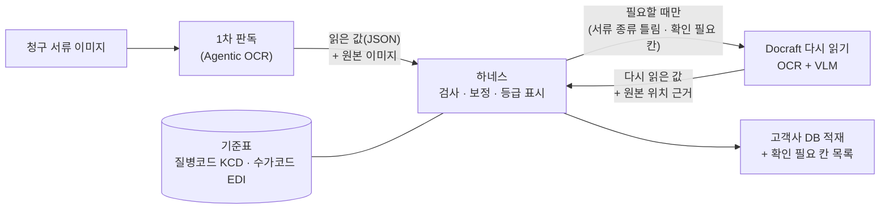
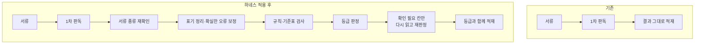
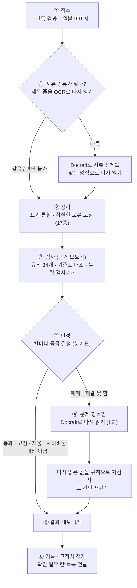
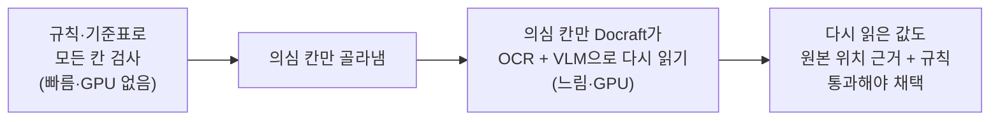
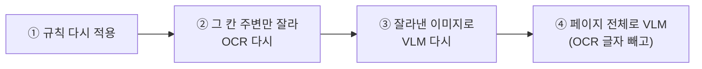

날짜: 2026-09-29 작성 (2026-09-30 주간보고용)  
브랜치: 해당 없음 — 루트는 Git 저장소가 아님 (근거 코드: harness-v2 `dev` `06a9ca4`, Docraft `dev` `ee81eba`)  
워크트리: 해당 없음

**읽는 법**

- **1부(발표용, 15분)**만 읽어도 전체 그림이 잡힌다.
- **2부(상세편)**는 질문이 나왔을 때 펼쳐 보는 자료다. 규칙 하나하나, 실제 프롬프트, 판독 결과 실물이 들어 있다.
- 이전 문서: [2026-09-29 하네스 처리 흐름 쉬운 설명](2026-09-29-harness-flow-briefing.md)

**구현 상태 표시**: ✅ 현재 구현 · 🟡 부분 구현(조건부·기본 꺼짐) · ⏳ 향후 과제 · ❌ 없음

---

# 1부 — 발표용

## 1. 하네스란?

하네스는 **1차 판독기(Agentic OCR)가 서류에서 읽어 낸 값을 그대로 믿지 않고 다시 따져 보는 검수 단계**다.

- **규칙으로 검사한다.** 금액 계산이 맞는지, 질병코드·수가코드가 실제로 있는 코드인지, 날짜·성별이 서로 앞뒤가 맞는지 본다.
- **확실할 때만 고친다.** 틀린 것이 확실하고 고칠 근거도 확실할 때만 값을 고치고, 원래 값도 함께 남긴다.
- **애매하면 다시 읽힌다.** 확신이 없으면 고치지 않고 "확인 필요" 표시를 붙인다. 그런 칸만 다시 읽기 서비스(Docraft)에 한 번 더 읽힌다.
- **등급을 붙인다.** 최종적으로 모든 칸에 **"얼마나 믿어도 되는지" 등급**을 붙여 돌려준다.

> **비유**: 1차 판독기가 **답안을 쓴 학생**이라면 하네스는 **채점 선생님**이다.
> Docraft는 헷갈릴 때 부르는 **돋보기 담당**이다.
> 선생님은 답을 새로 쓰지 않는다. 채점하고, 근거가 확실한 것만 고친다.

**핵심 메시지: "AI가 읽은 값을 바로 믿는 구조에서, 근거를 확인한 뒤 확정하는 구조로 바꾼다."**

## 2. 전체 구조와 위치



> 한 줄 설명: "하네스는 1차 판독과 고객사 DB 사이에 있는 검수 단계입니다. 판단은 하네스가 하고, 이미지를 다시 읽는 일은 Docraft가 맡습니다."

- **들어오는 것**: 1차 판독 결과(JSON)와 원본 이미지. 이미지는 비동기 요청일 때만 함께 온다.
- **나가는 것**: 원래 결과 구조는 그대로 두고, 칸마다 등급·근거·고친 값을 덧붙인다. 원래 값도 보관한다.
- **역할 분담**: 하네스는 AI 모델을 직접 부르지 않는다. 이미지를 읽는 AI(OCR·VLM)는 모두 Docraft 안에 있다. 판단 기준은 하네스 한 곳에만 둔다.

### 다루는 문서 유형

| 문서 유형 | 무엇을 검사하나 | 규칙 수 | 기준표 | 상태 |
|---|---|---|---|---|
| **진료비 영수증** | 금액 계산(총액·환자부담·납부액), 표 합계, 표 모양, 질병군 번호 형식 | 11 | — | ✅ |
| **진료비 세부내역서** (입원·통원) | 행 계산(단가×횟수×일수), 열 합계, 수가코드 존재·이름 일치, 표 모양 | 10 | EDI 수가코드 | ✅ |
| **진단서 · 소견서 · 입원확인서 · 수술확인서** | 질병코드 형식·존재·병명 일치, 코드–병명 짝, 성별·생년월일, 사고일 | 13 (4종 공통) | KCD 질병코드 | ✅ (수술확인서는 부분 지원) |
| **약제비 영수증** | 필수 칸이 채워졌는지, 날짜 표기만 확인. **금액 계산 규칙은 없다** | 0 | — | 🟡 |
| 그 밖의 서류 (처방전 등) | 검사하지 않음 | 0 | — | ❌ |

> 한 줄 설명: "영수증은 돈 계산, 세부내역서는 행 계산과 수가코드, 진단서류는 질병코드를 중심으로 봅니다. 약제비 영수증은 아직 빈칸 검사만 합니다."

### Before / After



> 한 줄 설명: "예전에는 읽은 값을 그대로 넣었습니다. 이제는 검사하고, 확실한 것만 고치고, 칸마다 믿음 정도를 붙여서 넣습니다."

## 3. 처리 흐름 (가장 중요)



> 한 줄 설명: "먼저 서류 종류를 확인하고, 규칙으로 검사해서 등급을 매깁니다. 애매한 칸만 한 번 더 읽혀서 다시 판정합니다."

| 단계 | ① 무엇을 확인하나 | ② 어떤 오류를 찾나 | ③ 찾으면 어떻게 하나 | ④ 왜 필요한가 | 상태 |
|---|---|---|---|---|---|
| ① 접수 | 판독 결과와 이미지가 짝이 맞는지 | 형식이 깨진 입력 | 접수번호를 붙이고 진행하거나 거절 | 잘못된 입력이 뒤로 넘어가지 않게 | ✅ |
| ①' 서류 종류 재확인 | 1쪽 윗부분 25%의 **큰 글씨 제목** | 영수증을 진단서로 분류하는 식의 오분류 | 맞는 양식으로 Docraft가 서류 전체를 다시 읽음 | 서류 종류가 틀리면 모든 칸이 틀린다. **현재 개선 효과의 대부분이 여기서 나왔다** | 🟡 이미지 있는 비동기·1쪽 서류만 |
| ② 정리 | 날짜 표기, 항목명, 금액 열 위치, 질병코드 첫 글자 | 날짜 표기 차이, 질병코드 첫 글자 오인식(`110`→`I10`), 금액 열 뒤바뀜, 병명 앞 "(주상병)" 표지 | 확실한 것만 고침 (2부 C) | 같은 값을 같은 모양으로 맞춰야 검사가 정확하다 | ✅ |
| ③ 검사 | 계산·코드 존재·칸 사이 관계·필수 칸 | 합계 불일치, 없는 코드, 코드–병명 불일치, 성별 모순, 필수 칸·행 누락 | **바로 판정하지 않고 근거로만 모은다** | 규칙 하나만으로 틀렸다고 단정하지 않기 위해 | ✅ |
| ④ 판정 | 모은 근거 전체 | — | 분기표(23개 경우)로 칸마다 등급을 붙인다. 판정은 이 한 곳에서만 한다 | 판단 기준이 흩어지면 결과를 설명할 수 없다 | ✅ |
| ④' 애매한 칸 다시 읽기 | "애매·해결 못 함" 칸 | 1차 판독이 잘못 읽은 값, 빈칸 | 그 항목만 Docraft에 다시 읽혀 규칙으로 재검사하고 재판정한다 | 모든 칸을 다시 읽으면 서류당 수십 초~2분이 걸린다 | 🟡 이미지 있는 비동기·1쪽 서류만 |
| ⑤ 내보내기 | — | — | 확실히 고친 값(고침·채움·자리바꿈)은 값에 반영하고 원래 값도 보관한다 | 고객사가 근거를 추적할 수 있게 | ✅ |

**설계 원칙 — 모든 칸을 AI로 다시 보지 않는다**



> 한 줄 설명: "규칙은 모든 칸에 싸게 돌리고, 비싼 AI 다시 읽기는 의심 칸에만 씁니다. AI가 읽은 값도 규칙을 통과해야 받아들입니다."

## 4. 예시 서류 한 장으로 따라가 보기

**가상 진단서** (이미지가 있는 비동기 요청, 1쪽)

| 칸 | 원본 서류에 적힌 값 | 1차 판독이 읽은 값 | 무엇이 잘못됐나 |
|---|---|---|---|
| 환자 이름 | 홍길동 | 홍길동 | — |
| 병명 1줄 코드 | I10 | **110** | 영문 I를 숫자 1로 읽음 |
| 병명 1줄 병명 | 본태성(원발성) 고혈압 | **(주상병)본태성(원발성) 고혈압** | 서식 표지까지 같이 읽음 |
| 병명 2줄 코드 | M54.5 | **M54.S** | 숫자 5를 영문 S로 읽음 (중간 글자) |
| 병명 2줄 병명 | 요통 | 요통 | — |
| 최종진단 / 임상적추정 | ☑ / □ | Y / **(빈칸)** | 체크 안 된 칸을 비워 둠 |
| 진단일 | 2026.08.16 | **2026-08-15** | 6을 5로 읽음 |

### ①' 서류 종류 재확인

제목 OCR 결과 `진 단 서`가 큰 글씨 줄에서 발견된다. 1차 판독의 분류(진단서)와 같다. → 그대로 진행한다.

### ② 정리 — 확실한 것만 바로 고친다

| 칸 | 전 | 후 | 근거 | 결과 |
|---|---|---|---|---|
| 진단일 | 2026-08-15 | 20260815 | 날짜 표기 통일. **값은 그대로다** | 표기만 바뀜 |
| 병명 1줄 병명 | (주상병)본태성(원발성) 고혈압 | 본태성(원발성) 고혈압 | 병명 앞 서식 표지 제거 | 고침 후보 |
| 임상적추정 | (빈칸) | N | 최종진단이 Y이면 짝은 N | 고침 후보 |
| 병명 1줄 코드 | 110 | I10 | 질병코드는 영문으로 시작해야 한다. 첫 글자 1→I 치환. **기준표에 I10이 있고 병명 "본태성(원발성) 고혈압"과 맞을 때만** 채택 | 고침 후보 |

### ③ 검사 — 근거를 모은다

| 칸 | 규칙 결과 |
|---|---|
| 병명 1줄 코드 `I10` | 형식 ✔ · 기준표에 있음 ✔ · 병명과 일치 ✔ |
| 병명 2줄 코드 `M54S` | 형식 ✔ · **기준표에 없음 ✘** (`MASTER_KCD_03`) |
| 진단일 `20260815` | 형식 ✔ · 사고일 계산과 모순 없음 ✔ → **이상 없어 보임** |
| 서류 전체 | 필수 칸 4개(발급일·병원명·병원주소·병명내역) 모두 채워짐 ✔ |

### ④ 판정

| 칸 | 등급 | 분기 |
|---|---|---|
| 환자 이름 | 통과 | 3 |
| 병명 1줄 코드 | **고침** `110`→`I10` | 10-e (코드 첫 글자 오인식) |
| 병명 1줄 병명, 임상적추정 | **고침** | 10-n (정리 단계 보정) |
| 병명 2줄 코드 | **해결 못 함** | 10 (기준표에 없음 — 비슷한 코드를 추측해서 고치지 않는다) |
| 진단일 | 통과 ⚠️ | 3 |

→ 서류 등급은 가장 나쁜 칸을 따라 **해결 못 함**이 된다. 확인 필요 칸 목록은 `["tables[병명내역].rows[1].cells[병명코드]"]`이다.

### ④' 애매한 칸 다시 읽기

하네스가 Docraft에 **페이지 이미지 + `doc_type=진단서` + `keys=["병명내역"]`**를 보낸다.

1. Docraft가 PaddleOCR로 글자와 위치를 읽고, VLM(Qwen3-VL-32B)에 이미지와 OCR 글자를 함께 줘서 병명내역을 다시 뽑는다. (실제 프롬프트는 2부 G)
2. 결과는 `M54.5`이고, 원본의 어느 위치에서 읽었는지 근거(좌표·원문 글자)도 함께 온다.
3. 하네스는 두 값을 비교한다.
   - 1차 값 `M54S`는 규칙 실패, 다시 읽은 값 `M545`는 기준표에 있고 병명 "요통"과 일치한다.
   - 서로 독립인 두 근거가 같은 방향이다. → **분기 7: 고침** (다시 읽은 값 채택)

### ⑤ 최종 결과

| 칸 | 최종 값 | 등급 | 원래 값 보관 |
|---|---|---|---|
| 환자 이름 | 홍길동 | 통과 | — |
| 병명 1줄 코드 | I10 | 고침 | 110 |
| 병명 1줄 병명 | 본태성(원발성) 고혈압 | 고침 | (주상병)본태성(원발성) 고혈압 |
| 병명 2줄 코드 | M545 | 고침 (다시 읽기) | M54.S |
| 임상적추정 | N | 고침 | (빈칸) |
| 진단일 | **20260815 (틀린 값 그대로)** | 통과 | — ⚠️ |

> 한 줄 설명: "첫 글자 오인식은 기준표로 확인해서 바로 고쳤습니다. 중간 글자 오인식은 다시 읽혀서 고쳤습니다. 다만 형식이 정상인 날짜 오류는 지금 구조로는 못 잡습니다."

### 현재 한계 — 날짜 예시

`2026-08-15`처럼 **형식도 정상이고 다른 칸과도 모순이 없는 오류**는 현재 잡지 못한다.

- 하네스는 1차 판독 값이 원본 이미지의 그 위치에 실제로 적혀 있는지 직접 대조하지 않는다.
- ④'에서도 **확인 필요 칸(병명내역)만** 다시 읽는다. 진단일은 다시 읽지 않는다.
- 이런 오류는 다른 날짜와의 관계 규칙에 걸릴 때만 간접적으로 드러난다.
- 서류 전체를 매번 다시 읽는 설정(`REREAD_MODE=full`)은 있지만, 서류당 수십 초가 걸려 꺼 두었다. → ⏳ 향후 과제

## 5. 규칙 / OCR / VLM 비교

| 방식 | 쉽게 말하면 | 장점 | 한계 | 쓰는 곳 | 상태 |
|---|---|---|---|---|---|
| **규칙** (34개 + 누락 검사 4개) | 계산기·체크리스트 | 빠르다. 이유가 명확하다. 모든 칸에 적용할 수 있다 | 정해진 유형만 잡는다. 형식이 정상인 오류는 못 잡는다 | 하네스 — 모든 칸 | ✅ |
| **기준표 대조** | 공식 코드 사전 찾아보기 | "없는 코드"를 확실히 판별한다 | 사전 범위 밖 코드(약품·원내코드 등)는 판단하지 않는다 | 하네스 — 코드 칸 | ✅ |
| **OCR 다시 읽기** | 원본 글자를 다시 읽기 | 글자와 **위치(근거)**를 함께 얻는다 | 문맥은 모른다 | 하네스(제목) · Docraft(칸) | ✅ |
| **VLM** | 사람이 서류를 다시 보는 것과 비슷 | 표·문맥·이미지를 함께 보고 값을 읽는다 | 느리고 GPU가 필요하다. 틀리게 읽을 수도 있다 | Docraft만 — 의심 칸 / 서류 전체 | ✅ (호출 조건 제한) |

> 한 줄 설명: "규칙은 빠른 검사표, OCR은 원본 재확인, VLM은 사람처럼 다시 보기입니다. 판정은 끝까지 하네스의 규칙이 합니다."

**중요한 점**

- VLM은 **정답을 판정하지 않는다.** 다시 읽은 값을 돌려줄 뿐이다.
- VLM 프롬프트에는 **"없는 값을 지어내지 말 것", "OCR 글자는 철자 참고용으로만 쓸 것"**이 들어 있다.
- 받아들일지는 하네스가 원본 위치 근거와 규칙·기준표로 다시 검사해서 결정한다.

## 6. 결과 등급

| 등급 | 쉬운 뜻 | 예시 | 값 반영 | 사람 확인 |
|---|---|---|---|---|
| **통과** (pass) | 모든 검사를 통과했다 | 환자 이름 "홍길동" | 원래 값 | — |
| **고침** (repaired) | 원래 값이 규칙상 있을 수 없어서 확실한 근거로 고쳤다 | 질병코드 `110`→`I10` | 고친 값 (원래 값 보관) | — |
| **채움** (inferred) | 비어 있던 값을 기준표에서 찾아 채웠다 | 코드 `M545`만 있고 병명이 빔 → "요통" | 채운 값 | — |
| **자리 바꿈** (swap) | 질병코드와 병명의 짝이 엇갈려 있어서 맞췄다 | 코드 [B, A] · 병명 [A병, B병] → 짝 맞춤 | 바꾼 값 | — |
| **애매** (ambiguous) | 가능한 답이 여러 개다. 고르지 않고 후보만 적는다 | 병명만 있고 코드 후보가 여럿 | 빈칸 + 후보 | ✔ |
| **해결 못 함** (unresolved) | 틀린 것 같지만 고칠 근거가 없어 원래 값을 유지한다 | 합계가 안 맞는데 어느 칸이 틀렸는지 모름 | 원래 값 | ✔ |
| **대상 아님** (out_of_scope) | 기준표 범위 밖이라 검사하지 않았다. 정확도 계산에서도 뺀다 | 세부내역서의 병원 자체 코드 | 원래 값 | — |

> 한 줄 설명: "초록(통과·고침·채움·자리바꿈)은 그대로 쓰고, 노랑(애매·해결 못 함)은 확인 필요 칸 목록으로 넘깁니다."

- 서류 등급은 칸 중 **가장 나쁜 등급**을 따른다. 순서는 통과 < 채움 < 고침 < 자리바꿈 < 애매 < 해결 못 함이다.
- 하네스 안에 사람이 검토하는 단계는 없다. 모든 서류를 적재하고 확인 필요 칸 목록(`review_paths`)을 함께 넘긴다.
  - 사람이 검수하는 화면은 고객사 쪽 영역이다.

## 7. 기대효과와 현재 성과

| 효과 | 업무 관점 설명 | 상태 |
|---|---|---|
| 정확도 향상 | 1차 판독 값을 그대로 쓰지 않고 서류 종류·계산·코드를 다시 확인한다 | ✅ |
| 오류 자동 발견 | 사람이 모든 칸을 보지 않아도 "확인 필요" 칸이 자동으로 표시된다 | ✅ |
| 자동 보정 | 근거가 확실한 오류 17종은 자동으로 고친다. 예: 코드 첫 글자 오인식, 금액 열 뒤바뀜, 표기 차이, 서식 표지 | ✅ |
| AI 사용 최소화 | 다시 읽기는 서류 종류가 틀렸거나 확인 필요 칸이 있을 때만 한다 | ✅ |
| 검수 효율 | 사람은 "애매·해결 못 함" 칸만 보면 된다 | ✅ (검수 화면은 고객사 영역) |
| 추적 가능성 | 칸마다 등급, 걸린 규칙, 원래 값, 다시 읽은 값과 원본 위치가 결과에 남는다 | ✅ |

**현재 성과**

- 표본 7종 210장 기준, 1차 판독 단독 **87.0%** → 하네스 적용 후 **93.0%**
  - 개선분 대부분은 **서류 종류 재확인**에서 나왔다.
  - 제목 판별 자체는 210장 중 정답 199 · 오답 0 · 판단 불가 11이었다.
  - ⚠️ 정답지를 사람이 검수하기 **전** 수치다.
- 처리시간:
  - 하네스 자체 시간은 **측정 필요**다.
  - Docraft 다시 읽기는 1회에 서류당 **약 25~127초**가 걸렸다(2026-09-27 측정: 세부내역서 25초 · 진단서 38초 · 영수증 127초).

**남은 과제** ⏳

- 원본 위치와 1차 판독 값의 직접 대조 (날짜 예시 같은 오류 대응)
- 약제비 영수증 금액 규칙
- 정답지 사람 검수 후 정확도 재측정
- 세부내역서 행 단위 오류 분석, 영수증 합계 행 열 밀림
- 여러 쪽 서류 다시 읽기 (현재 1쪽만)

## 8. 핵심 요약 (3줄)

> ① 하네스는 AI가 읽은 값을 그대로 믿지 않고, 서류 종류·계산·코드 기준표로 다시 확인해 칸마다 믿음 등급을 붙인다.
> ② 규칙 검사는 모든 칸에, AI 다시 읽기(Docraft)는 의심 칸에만 쓰고, 다시 읽은 값도 원본 위치와 규칙을 통과해야 받아들인다.
> ③ 근거가 확실한 오류만 자동으로 고치고(원래 값 보관), 애매한 칸은 고르지 않고 사람 확인 목록으로 넘긴다.

---

# 2부 — 상세편

## A. 문서 유형별 적용 범위

| 문서 유형 (문서코드) | 규칙 | 필수 칸 검사 (룰 1) | 필수 행 검사 (룰 2) | 빈칸 보충 (룰 3·4) | 정리 단계 보정 | 기준표 | 서류 종류 재확인 | Docraft 다시 읽기 |
|---|---|---|---|---|---|---|---|---|
| 진료비 영수증 (AC029) | 11개 | 12칸 | 진찰료·CT진단료 행 (한방 영수증은 CT 제외) | ✅ | 날짜 + 영수증 5종 | — | ✅ | ✅ |
| 세부내역서 (입원 0710 / 통원 0720) | 10개 | 항목내역 표 | — | ✅ | 날짜 + 세부내역서 6종 | EDI 수가코드 | ✅ | ✅ |
| 진단서 (0120) | 13개 | 4칸 | — | — | 날짜 + 진단서류 4종 | KCD | ✅ | ✅ |
| 소견서 (1333) | 13개 | 3칸 | — | — | 〃 | KCD | ✅ | ✅ |
| 입원확인서 (0130) | 13개 | 5칸 | — | — | 〃 | KCD | ✅ | ✅ |
| 수술확인서 (1250) | 13개 (부분 지원) | 4칸 (수술내역 포함) | — | — | 〃 | KCD | ✅ | ✅ |
| **약제비 영수증** (0730) | **0개** | 9칸 | — | — | 날짜만 | — | ✅ | ✅ |
| 그 밖의 서류 | 0개 | — | — | — | 날짜만 | — | 제목 규칙에 없으면 1차 분류 유지 | ❌ |

**필수 칸 목록**

| 문서 | 필수 칸 |
|---|---|
| 진단서 | 발급일 · 병원명 · 병원주소 · 병명내역 |
| 소견서 | 발급일 · 병원명 · 병명내역 |
| 입원확인서 | 입원일자 · 퇴원일자 · 발급일 · 병원명 · 병명내역 |
| 수술확인서 | 발급일 · 병원명 · 병명내역 · 수술내역 |
| 진료비 영수증 | 외래/입원 · 발행일 · 기관명 · 사업자번호 · 주소 · 진료과 · 진료시작일 · 진료종료일 · 환자구분 · 진료비총액 · 환자부담총액 · 항목내역 |
| 세부내역서 | 항목내역 |
| 약제비 영수증 | 조제일자 · 총액 · 급여본인부담 · 공단부담액 · 비급여및전액본인부담금 · 환자부담총액 · 수납금액 · 약국 상호 · 약국 사업자번호 |

- 필수 칸은 정답지에서 95% 이상 값이 있던 칸을 기준으로 골랐다.

**약제비 영수증 주의**

- 규칙 파일을 합의된 요건 범위로 줄이면서 약제비 영수증의 금액 규칙이 0개가 됐다.
- 검사하는 것: 필수 칸 9개, 날짜 표기, 서류 종류 재확인, Docraft 다시 읽기.
- 검사하지 않는 것: 금액 계산.
- 규칙이 없는 칸은 "검증한 칸"으로 세지 않는다. 그래서 등급이 "통과"로 잘못 나가지 않고 "판정 재료 없음"으로 남는다.

**서류 종류 재확인 제목 규칙** — 위에서부터 먼저 맞는 것을 쓴다. 공백·기호는 빼고 비교한다.

| 순서 | 판정 | 제목에 이런 말이 있으면 |
|---|---|---|
| 1 | 약제비 영수증 | 약제비 · 약국 |
| 2 | 세부내역서 | 세부(산정)내역 · 진료비내역서 · 일자별 |
| 3 | 진료비 영수증 | 계산서·영수증 · 진료비영수증 · 진료비내역확인 |
| 4 | 입원확인서 | 입퇴원 · 입원사실 · 입원확인 · 입원증명 · 퇴원확인 · 퇴원증명 |
| 5 | 수술확인서 | 수술확인 · 수술증명 · 수술사실 · 시술확인 |
| 6 | 소견서 | 소견서 · 진료소견 |
| 7 | 진단서 | 진단서 |

- **큰 글씨 줄**(윗부분 줄 높이 중앙값의 1.4배 이상)에서 찾았을 때만 1차 분류를 뒤집는다. 본문 줄에서만 찾으면 바꾸지 않는다.
- 같은 계열(예: 진단서↔소견서)이면 서류 종류 이름만 고친다. 계열이 다르면(예: 진단서↔영수증) Docraft로 서류 전체를 다시 읽는다.

## B. 규칙 34개 전체

**공통**

- **금액 비교**: 양쪽을 100원 단위로 내린 값이 같거나 차이가 100원 미만이면 맞는 것으로 본다.
  - 예: 2,694,904 vs 2,694,870 → 맞음
- **계산 규칙에 걸리면**: 값은 고치지 않고 **해결 못 함**이 된다.
  - 비동기라면 ④'에서 해당 표를 다시 읽는다. 다시 읽은 값이 규칙을 통과하면 **고침**이 된다.
- **경고(warn) 규칙**: 통과를 막지 않고 기록만 남긴다.
- **해당 없음**: 칸이 비었거나 서식에 해당 칸이 없으면 판정에 영향을 주지 않는다.
- **영수증 이미지가 잘린 경우**: 합계 영역이 이미지 끝에 닿아 잘렸으면, 그 영역을 읽는 규칙은 "해당 없음"으로 돌린다.

### B-1. 진료비 영수증 — 11개

| 규칙 | 쉬운 이름 | 무엇을 보나 | 걸리면 | 예시 |
|---|---|---|---|---|
| `CALC_AC029_01` | 총액 = 급여 + 비급여 | 진료비총액 = (본인부담금 + 공단부담금 + 전액본인부담) + (선택진료료 + 선택진료료외) | 해결 못 함 | 총액 279,600, 급여 합 279,683 → 100원 절사 후 같음 → 통과 |
| `CALC_AC029_02` | 환자부담총액 | 환자부담총액 = 본인부담금 + 전액본인부담 + 비급여 | 해결 못 함 | 30,000 + 5,000 + 10,000 = 45,000 → 통과 |
| `CROSS_AC029_05` | 오른쪽 요약 ↔ 아래 표 | 오른쪽 진료비총액 = 아래 합계 행의 급여 + 비급여 | 해결 못 함 | 500,000 = 300,000 + 200,000 → 통과 |
| `CALC_AC029_10` | 표 열 합계 | 열(본인·공단·전액본인·선택진료·선택진료외)마다 항목 행 합 = 합계 행 | 해결 못 함 (해당 열에 표시) | 공단부담 항목 합 1,200,000 vs 합계 행 1,250,000 → 걸림 |
| `CALC_AC029_11` | 합계 행 급여 | 합계 행: 급여 = 본인 + 공단 + 전액본인 | 해결 못 함 | 279,600 vs 279,683 → 통과 |
| `CALC_AC029_12` | 합계 행 비급여 | 합계 행: 비급여 = 선택진료료 + 선택진료료외 | 해결 못 함 | 60,000 = 20,000 + 40,000 → 통과 |
| `R-AC029-PAYABLE` | 납부할 금액 | 납부할금액 = 환자부담총액 − 이미 낸 돈 − 각종 감액 + 부가세 | 해결 못 함 | 100,000 − 30,000 = 70,000 → 통과 |
| `R-AC029-PAID` | 낸 돈 합계 | 납부한금액 합계 = 카드 + 현금영수증 + 현금 | 해결 못 함 | 50,000 + 20,000 = 70,000 → 통과 |
| `R-AC029-BURDEN` | 총액 = 환자 + 공단 + 상한초과 | 진료비총액 = 환자부담총액 + 공단부담총액 + 상한액초과금 | 해결 못 함 | 500,000 = 300,000 + 200,000 → 통과 |
| `STRUCT_AC029_13` | 표 모양 | 항목내역 표의 열마다 값 개수 = 행 수 | 해결 못 함 (짧은 열·밀린 행 기록) | 머리글 8열인데 3행이 7칸 → 걸림 |
| `FMT_AC029_DRG` | 질병군 번호 모양 | 질병군(DRG) 번호 = 영문 1자 + 숫자 4~5자리 | 해결 못 함 | `G10600` 통과 / `G106` 걸림 (사업자번호처럼 아예 다른 모양은 정리 단계에서 비움) |

### B-2. 진료비 세부내역서 — 10개

| 규칙 | 쉬운 이름 | 무엇을 보나 | 걸리면 | 예시 |
|---|---|---|---|---|
| `R-0710-ROWSUM` | 행 총액 | (본인 + 공단 + 전액본인 + 비급여) × 일수(또는 횟수, 또는 1) = 총액. 셋 중 하나만 맞아도 통과 | 해결 못 함 | (1,000 + 2,000 + 500) × 2일 = 7,000 → 통과 |
| `R-0710-PARTITION` | 열 소계 = 합계 칸 | 본인·공단·전액본인·선택진료·선택진료외·비급여 열 합 = 아래 각 총액 칸 | 해결 못 함 (두 열이 서로 상쇄되면 급여구분 오배치로 기록) | 공단 열 합 1,250,000 vs 공단부담총액 1,200,000 → 걸림 |
| `R-0710-UNITMUL` | 단가 × 횟수 × 일수 | 단가 × 횟수 × 일수 (× 투여량) = 총액 | 해결 못 함 | 100 × 2 × 3 = 600 → 통과 |
| `CALC_0710_17` | 합계 급여총액 | 급여총액 = 본인부담총액 + 공단부담총액 + 전액본인부담총액 | 해결 못 함 | 4,500 + 10,600 + 0 = 15,100 → 통과 |
| `CALC_0710_18` | 합계 비급여총액 | 비급여총액 = 선택진료료총액 + 선택진료료외총액 | 해결 못 함 | 두 칸 모두 비면 해당 없음 |
| `MASTER_0710_08` | 수가코드가 있나 | EDI 코드를 수가 기준표에서 찾는다. 없으면 원내코드 칸에 EDI 코드가 들어갔는지도 본다 | 기준표에 없으면 **대상 아님** (약품·치료재료·원내코드 등) | `AU211` 있음 → 통과 / 원내코드 `X12` → 대상 아님 |
| `MASTER_0710_09` | 수가코드 이름 일치 | 기준표 공식 이름과 서류 항목명이 비슷한지 (문장 유사도 0.2 기준) | 해결 못 함 + 후보 코드 첨부 (코드 오인식 의심) | 코드는 주사료인데 이름이 "식대" → 걸림 |
| `MASTER_0710_10` | 코드 빈칸이면 후보 찾기 | 항목명으로 기준표 후보를 찾는다 | **애매** (병원마다 이름이 달라 자동 채택 안 함) | "진찰료-초진", 코드 빈칸 → 후보 목록만 기록 |
| `MASTER_0710_11` | 단가 대조 | 행 단가를 기관 종류별 기준 단가와 비교 | 기록만 (고시 개정으로 단가가 바뀌므로 판정 안 함) | 11,000 vs 기준 10,500 → 기록만 |
| `STRUCT_0710_16` | 표 모양 | 항목내역 표 행·열이 맞는가 | 해결 못 함 | 영수증과 같음 |

### B-3. 진단서 · 소견서 · 입원확인서 · 수술확인서 — 13개 (4종 공통)

| 규칙 | 쉬운 이름 | 무엇을 보나 | 걸리면 | 예시 |
|---|---|---|---|---|
| `FMT_KCD_01` | 코드 정리 가능 | 질병코드에서 `.`을 빼도 코드 모양인가 | 기록 (첫 글자 오인식이면 10-e가 먼저 고침) | `C20.9` → `C209` 통과 |
| `FMT_KCD_02` | 코드 모양 | 영문 1자로 시작하는 3~6자리 | 해결 못 함 (첫 글자 숫자면 10-e 고침 시도) | `0990` → 걸림 → `O990`이 기준표에 있고 병명과 맞으면 고침 |
| `MASTER_KCD_03` | 코드가 있나 | KCD 기준표(47,798건)에 있는가 | 해결 못 함 (비슷한 코드를 추측하지 않음) | `M54S` 없음 → 걸림 |
| `MASTER_KCD_04` | 코드–병명 일치 | 코드의 공식 병명과 서류 병명이 맞나 (단어 겹침·부분 일치·유사도) | 해결 못 함 + 공식 병명 첨부 | `J06` + "급성상기도감염" → 통과 |
| `ENRICH_KCD_05` | 빈 병명 채우기 | 코드만 있고 병명이 비었으면 공식 병명을 제안 | 후보 1개 → **채움**, 여러 개 → **애매** | `M545` + 빈칸 → "요통" 채움 |
| `R-KCD-REVERSE` | 빈 코드 찾기 | 병명만 있으면 병명으로 코드를 역으로 찾는다 | 확실한 1위 → **채움**, 비슷한 후보들 → **애매**, 없음 → 해결 못 함 | "제2형 당뇨병" → 단독 1위 코드 채움 |
| `SORT_KCD_06` | 중복 코드 | 같은 코드가 두 번 나오는가 (적힌 순서는 문제 삼지 않음) | 경고 | `M545, J06, M545` → 경고 |
| `R-KCD-AXIS` | 좌우·부위 자리 | 코드의 좌우·부위 자리와 병명의 "좌측·무릎" 등이 맞는가 | 해결 못 함 | 병명 "우측 무릎", 코드는 좌측 → 걸림 |
| `R-KCD-PAIRING` | 코드–병명 짝 | 병명 순서를 기준으로 코드를 제 짝에 다시 놓는다 (모든 코드가 기준표에 있을 때만) | **자리 바꿈** | 코드 [B, A] · 병명 [A병, B병] → 짝 맞춤 |
| `R-CERT-ACCIDENT` | 사고일 계산 | 사고발생일자 = 진단일과 가장 이른 검사일 중 빠른 날 (진단일 없으면 수술·검사·치료일 중 가장 빠른 날) | 정리 단계에서 다시 계산 → **고침** | 진단일 20210310, 검사일 20210305 → 사고일 20210305 |
| `FMT_CERT_STATUS` | 최종진단·임상추정 | 값이 Y 또는 N인가 | 해결 못 함 (한쪽 Y·한쪽 빈칸은 정리 단계에서 N) | Y / 빈칸 → Y / N |
| `R-CERT-SEX` | 성별 ↔ 주민번호 | 주민번호 뒷자리 첫 숫자 1·3 = 남, 2·4 = 여 | 경고 | 성별 여 · 주민번호 ...-1 → 경고 |
| `R-CERT-BIRTH` | 생년월일 ↔ 주민번호 | 주민번호 앞 6자리 + 세기(1·2 → 19, 3·4 → 20) | 경고 | 050315-3... · 생년월일 19050315 → 경고 |

## C. 정리 단계 자동 보정 17종

- 검사 **전에** 적용한다. 그래서 규칙은 고친 값으로 검사한다.
- 고친 칸에 규칙 위반이나 기준표 불일치가 남으면 고친 값을 채택하지 않고 확인 필요로 보낸다(분기 10-n).
- 원래 값은 항상 보관한다.

| 문서 | 보정 | 언제만 | 전 → 후 |
|---|---|---|---|
| 모든 문서 | 날짜 표기 통일 | 날짜 하나로 읽히는 표기만 (기간·없는 날짜는 그대로) | `2021.6.3` · `2021년 6월 3일` → `20210603` |
| 세부내역서 | 자리 표시 급여구분 비우기 | 급여구분이 `열추출` | `열추출` → (빈칸) |
| 세부내역서 | 항목을 섹션 제목으로 | 항목이 자기 EDI 명칭을 베꼈을 때 | "초진진찰료" → `01.진찰료` |
| 세부내역서 | 병실 칸의 진료과 비우기 | 병실 칸에 "○○과"가 들어갔을 때 | "내과혈액종양" → (빈칸) |
| 세부내역서 | 복사된 진료기간 비우기 | 3행 이상이 모두 같은 기간 | 모든 행 20210601~20210610 → (빈칸) |
| 세부내역서 | 합계 비급여총액 채우기 | 합계는 0인데 항목 비급여 합 > 0이고 나머지 총액이 모두 맞을 때 | 0 → 3,000 |
| 세부내역서 | 갈라진 코드 합치기 | EDI 코드 칸에 한 글자, 원내코드 칸에 나머지 | `PDZ090007` + `O` → `PDZ090007O` |
| 진료비 영수증 | 항목명 표준화 | 표준 이름 중 가까운 것이 하나뿐일 때 | "진칠료" → 진찰료, "식데" → 식대 |
| 진료비 영수증 | 금액 열 맞바꾸기 | 두 열을 바꾸면 두 열 모두 합계 행과 맞을 때만 | 본인 100,000 ↔ 공단 500,000 |
| 진료비 영수증 | 급여 → 비급여 이동 | 공단부담이 전부 0인데 급여에 금액이 있고, 옮기면 합계가 맞을 때 | 급여 279,683 → 비급여 279,683 |
| 진료비 영수증 | 비급여 ↔ 선택진료료외 칸 이동 | 서식 머리글로 칸 구성을 판별한 뒤, 옮길 칸이 비어 있을 때 | 선택진료료외 50,000 → 비급여 50,000 |
| 진료비 영수증 | 엉뚱한 질병군 번호 비우기 | 사업자번호·병실번호처럼 아예 다른 모양 | `212-82-07728` → (빈칸) |
| 진단서류 | 병명 앞 표지 제거 | `(주상병)`, `(부 질병·부상)` 등 | "(주상병)급성 인두염" → "급성 인두염" |
| 진단서류 | 합쳐진 병명 나누기 | 모든 조각이 각 행 코드의 공식 병명과 맞고, 나누는 방법이 하나뿐일 때 | "허리, 손목 등의 염좌" → "허리" / "손목 등의 염좌" |
| 진단서류 | 체크박스 짝 채우기 | 한쪽 Y, 다른 쪽 빈칸 | Y / 빈칸 → Y / N |
| 진단서류 | 사고일 다시 계산 | 사고일 규칙과 같은 계산 | 20210310 → 20210305 |
| 진단서류 | 질병코드 첫 글자 오인식 | 첫 글자가 숫자(0→O, 1→I, 5→S, 8→B, 2→Z, 6→G)이거나 6자 초과. **고친 코드가 기준표에 있고 병명과 맞을 때만** | `0990` → `O990`, `110` → `I10` |

## D. 추출 누락 검사 4개

1차 판독은 값이 없어도 칸 이름을 항상 낸다. 그래서 "비었다"는 두 가지 뜻일 수 있다.
- 서류에 실제로 인쇄되지 않은 것
- 인쇄됐는데 1차 판독이 놓친 것

**늘 인쇄되는 칸·행 목록**으로 후자를 잡는다.

| 룰 | 조건 | 걸리면 | 예시 |
|---|---|---|---|
| 룰 1 필수 칸 | 필수 칸 채움 비율 < 97% | 서류를 **해결 못 함**으로 보내고 빈 칸을 확인 필요 목록에 넣는다 → ④'에서 다시 읽기 | 진단서 필수 4칸 중 1칸 빔 → 75% → 걸림 |
| 룰 2 필수 행 | 영수증 항목 표에 진찰료·CT진단료 행이 없음 (한방 영수증은 CT 제외) | 해결 못 함 → Docraft가 찾은 행을 표 끝에 붙인다 (계산 규칙이 새로 깨지지 않을 때만 채택) | 진찰료 행 없음 → 다시 읽어 행 추가 |
| 룰 3 빈칸 보충 | 영수증·세부내역서 표의 빈 칸을 1차 판독의 원본 표(HTML)에서 같은 행·열 값으로 채운다 | **고침** (규칙 위반이 남으면 채택 안 함) | 공단부담금 "0" → 원본 표 12,300 |
| 룰 4 다시 읽은 뒤 빈칸 | 룰 3과 같은 방법으로, ④' 이후에도 빈 칸을 채운다 | 고침 | 룰 2로 붙인 행의 빈 금액 채움 |

- 룰 3·4는 1차 판독 원본 표 주소(`AO_API_URL`)가 설정돼야 동작한다. 🟡
- 원본 표 값이 이상하면 채우지 않는다. 예: 한 칸에 숫자가 둘 이상, 다른 금액보다 30배 넘게 큼.

## E. 판정 분기표 — 등급은 이렇게 정해진다

위에서부터 먼저 맞는 경우가 이긴다. "다시 읽기"는 Docraft 결과를 말한다.

| 분기 | 경우 (쉬운 말) | 등급 |
|---|---|---|
| 7-i | Docraft가 찾은 값(빠진 행 등)이 원본 근거와 서류 전체 규칙으로 확인됨 | 고침 |
| 7-a / 7-b | 하네스 자체 재판독으로 합계를 맞춤 / 못 맞춤 (Docraft 구성에서는 쓰지 않음) | 고침 / 해결 못 함 |
| 10-n | 정리 단계나 빈칸 보충이 고쳤고 그 칸에 문제가 없음 | 고침 |
| 10-a | 병명 빈칸 + 공식 병명 후보 1개 | 채움 |
| 10-b | 병명 빈칸 + 후보 여러 개 | 애매 |
| 10-c | 코드 빈칸 + 병명으로 찾은 코드가 정확히 1개 | 채움 |
| 10-d | 코드 빈칸 + 비슷한 후보들 (수가코드는 1개여도 자동 채택 안 함) | 애매 (후보 0개면 해결 못 함) |
| 10-f | 기준표 범위 밖 코드 | 대상 아님 |
| 1 | 1차도 빈칸, 다시 읽기도 빈칸 | 통과 |
| 2 | 1차는 빈칸인데 다시 읽기에만 값이 있음 (없던 값을 만들어 넣지 않음) | 해결 못 함 |
| 10-g | 코드–병명 짝을 다시 놓았고 기준표로 확인됨 | 자리 바꿈 |
| 10-e | 코드 첫 글자 오인식을 고쳤고 기준표·병명으로 확인됨 | 고침 |
| 11 | 코드는 있는데 이름이 안 맞음 | 해결 못 함 (+ 공식 이름·후보) |
| 10 | 코드가 기준표에 없음 | 해결 못 함 |
| 3 | 다시 읽지 않음 + 규칙 모두 통과 | 통과 |
| 4 | 다시 읽지 않음 + 규칙 위반 | 해결 못 함 |
| 5 | 다시 읽은 값이 1차와 같음 + 규칙 통과 | 통과 |
| 6 | 다시 읽은 값이 1차와 같음 + 규칙 위반 (서류 자체 오류일 수 있음) | 해결 못 함 |
| 7 | 다시 읽은 값이 다름 + 1차는 위반, 다시 읽은 값은 통과 | **고침 (다시 읽은 값)** |
| 8 | 다시 읽은 값이 다름 + 1차는 통과, 다시 읽은 값은 위반 | 통과 (1차 값 유지) |
| 9 | 다시 읽은 값이 다르고 어느 쪽이 맞는지 근거 없음 | 해결 못 함 |
| 12 | 어디에도 해당 없음 (안전한 쪽) | 해결 못 함 |

> 한 줄 설명: "두 번 읽은 값이 다르면, 규칙을 통과하는 쪽이 한쪽뿐일 때만 그쪽을 택합니다. 그 외에는 고르지 않습니다."

## F. 판독 결과는 이렇게 생겼다 (실물 예시)

### F-1. 1차 판독 결과 — 하네스가 받는 입력

실제 진단서 표본에서 줄였다(`harness-v2/docs/agentic-ocr-2.0.1-results/진단서/`).

```json
{
  "doc_type": "진단서",
  "extracted_fields": [
    {"key": "진단일", "value": "20230228", "confidence": 0.9979}
  ],
  "extracted_tables": [{
    "key": "병명내역", "headers": ["병명코드", "병명"],
    "rows": [
      [{"key": "병명코드", "value": "R634"},  {"key": "병명", "value": "(주상병)이상체중감소"}],
      [{"key": "병명코드", "value": "M8199"}, {"key": "병명", "value": "(부상병)상세불명의 골다공증, 상세불명 부분"}]
    ]
  }]
}
```

> 쉽게: 칸 이름(key), 읽은 값(value), 1차 판독의 자신감(confidence)이 칸마다 붙어 온다. 표는 행 단위로 온다.

### F-2. 하네스 결과 — 같은 구조에 `harness` 표시를 덧붙임

위 입력의 "병명" 칸 하나:

```json
{
  "key": "병명", "value": "이상체중감소",
  "harness": {
    "tier": "repaired",
    "decision_rule_no": "10-n",
    "ao_value": "(주상병)이상체중감소",
    "master_reference": {"system_id": "KCD", "code": "R634", "name": "이상체중감소"},
    "evidence": {
      "rule": [
        {"rule_id": "MASTER_KCD_04", "result": "pass", "detail": "명칭 일치: 이상체중감소"},
        {"rule_id": "R-KCD-PAIRING", "result": "pass", "detail": "짝 유지: 이상체중감소 — R634"}
      ],
      "normalization": {"from": "(주상병)이상체중감소", "steps": ["병명 앞 서식 표지 '(주상병)' 제거"]}
    }
  }
}
```

| 표시 | 뜻 |
|---|---|
| `tier: repaired` | 등급: 고침 |
| `decision_rule_no: 10-n` | 어떤 분기로 판정했나 (정리 단계 보정) |
| `ao_value` | 1차 판독의 원래 값 (보관) |
| `master_reference` | 기준표에서 찾은 공식 코드·이름 |
| `evidence.rule` | 어떤 규칙을 통과·위반했나 |
| `evidence.normalization` | 무엇을 어떻게 고쳤나 |

서류 단위 요약:

```json
{"tier": "repaired",
 "summary": {"fields_total": 35, "fields_verified": 9, "pass": 7, "repaired": 2, "unresolved": 0},
 "review_paths": [],
 "rule_results_summary": {"pass": 16, "fail": 0, "warn": 0, "not_applicable": 6, "total": 22}}
```

**해결 못 함 실제 사례 (소견서 표본)**

- 원본 코드는 `I678B`인데 OCR이 `B`를 `8`로 읽어 `I6788`이 됐다.
- 기준표에 없으므로 `tier: unresolved`, `review_paths: ["tables[병명내역].rows[0].cells[병명코드]"]`가 된다.
- 중간 글자 오인식은 자동으로 고치지 않고 다시 읽기와 사람 확인으로 넘긴다.

### F-3. 서류 제목 OCR — 서류 종류 재확인용

하네스가 1쪽 윗부분만 잘라 PP-OCRv5로 읽는다. 결과는 **줄마다 글자와 상자 좌표**다.

```json
{"rec_texts": ["진 단 서", "연번호", "주민등록번호"],
 "rec_boxes": [[722, 289, 937, 344], [224, 405, 357, 430], [745, 405, 878, 429]]}
```

> 쉽게: "진 단 서" 줄의 높이(55px)가 다른 줄(약 25px)의 2배쯤이라 **제목**으로 본다. 제목 규칙 7번(진단서)에 맞는다.

### F-4. Docraft의 OCR 결과 — 글자 덩어리와 위치

PaddleOCR-VL이 서류를 **덩어리(제목·본문·표)** 단위로 읽는다. 실제 진단서 표본의 결과다.

```
0 본문       [225,373,357,396]   "동 쪽 번 호"
1 제목       [722,289,937,344]   "진 단 서"
2 본문       [224,405,357,430]   "연번호"
3 본문       [745,405,878,429]   "주민등록번호"
4 표         [201,429,1459,1860] "<table><tr><td>환자의성명</td>…"
5 각주       [208,1860,876,1891] "*본증명서에직인및고밀도2차원바코드가없는경우무효입니다."
6 바닥글     [72,2076,1140,2108] "본 중명서는 https://www.medcerti.com에서 원본확인 가…"
```

- 숫자 네 개는 이미지 안 상자 위치다(왼쪽 위 x·y, 오른쪽 아래 x·y, 픽셀).
- 표는 HTML 그대로 나온다. 이 표본의 병명 칸은 이렇게 읽혔다.

```html
<td>건성안증후군\n파열되지 않은 대뇌동맥류</td><td>H0411\n1671</td>
```

> 쉽게: OCR도 틀린다. 여기서 `1671`은 원래 `I671`이다(영문 I를 숫자 1로 읽음). "증명서"도 "중명서"로 읽었다. 그래서 OCR 글자는 **철자 참고용**으로만 쓰고, 최종 값은 규칙과 기준표로 확인한다.

### F-5. Docraft 다시 읽기 응답 — 값 + 원본 위치 근거

위 표본을 Docraft 코드로 처리한 결과(요약):

```json
"fields": {"병원명": "충남대학교병원", "발급일": "20190628"},
"groundings": {
  "발급일": {"bbox": [606,1539,1051,1576], "source_text": "2019년06월 28일",
             "evidence_type": "date_equivalent", "normalized_value": "20190628", "verified": true}
},
"field_quality": {
  "병원명": {"status": "PASS", "action": "ACCEPT"},
  "진단일": {"status": "SUSPICIOUS", "issue_codes": ["missing_value"], "action": "RECHECK"}
}
```

| 표시 | 뜻 |
|---|---|
| `fields` | 다시 읽은 값 |
| `groundings` | 그 값을 원본의 **어디에서** 읽었나 (좌표·원문 글자). "2019년06월 28일"을 20190628로 바꿨음이 기록된다 |
| `field_quality` | Docraft 자체 품질 판단. 의심 칸은 `RECHECK` → Docraft 내부 재처리 대상 |

하네스는 **근거 위치와 원문 글자가 있고, 원문을 정리한 값이 다시 읽은 값과 같을 때만** 그 값을 판정에 쓴다.

## G. VLM에 보내는 실제 프롬프트

- **모델**: Qwen3-VL-32B-Instruct (운영: 고객사 GPU 서버 vLLM, FP8)
- **설정**: 온도 0(매번 같은 답), 응답 형식 JSON 강제, 추론 모드 끔
- **프롬프트를 만드는 곳**: Docraft 한 곳(`backend/engine.py` `extract`)뿐이다. 하네스는 VLM을 직접 부르지 않는다.

### G-1. 시스템 메시지 (코드 원문 + 번역)

```text
Extract values using document context and layout. Never invent values. Use null when allowed and absent.
A total or sum field takes the value printed in the document's total row or labelled total cell, never a single line item's value.
Return only a single JSON object that itself follows the given schema, with no wrapper key and with the schema's field order kept.
Table rows are evidence, not recall: return exactly the rows the document prints, in printed order, and never add a row the document does not print.
Keep the item name the document prints even when it is not one of the standard names you know.
The page image is attached: read the table structure (merged cells, column headers) from the image, and use the OCR text only as a spelling aid.
```

| 원문 | 뜻 | 왜 넣었나 |
|---|---|---|
| Never invent values. Use null… | 값을 지어내지 말고, 없으면 null | 없는 값을 만드는 것 방지 |
| A total or sum field takes the value printed in the total row… | 합계 칸은 인쇄된 합계 행 값을 쓴다 | 한 줄 금액을 합계로 착각하는 것 방지 |
| Return only a single JSON object… | 스키마 순서대로 JSON 하나만 | 자동 처리 |
| Table rows are evidence, not recall… | 표는 인쇄된 행만, 인쇄된 순서로 | 흔한 항목을 기억으로 채우는 것 방지 |
| Keep the item name the document prints… | 인쇄된 항목명을 그대로 | 표준명으로 바꿔 쓰는 것 방지 |
| The page image is attached… OCR text only as a spelling aid | 표 구조는 이미지에서, OCR 글자는 철자 참고만 | OCR 오인식을 그대로 옮기는 것 방지 |

- 표 규칙 두 문장은 표가 있는 스키마일 때 붙는다.
- 이미지 문장은 이미지를 첨부할 때 붙는다.
- 진단서는 둘 다 붙는다.

### G-2. 사용자 메시지 — 템플릿으로 조립한 예시 (4장의 가상 진단서)

메시지는 **① 페이지 이미지(JPEG, 긴 변 2000px)**와 **② 글**을 차례로 담는다. ② 글은 아래와 같다.

```text
Schema:
{"title": "진단서", "type": "object", "properties": {
  "진단일": {"type": ["string","null"],
            "description": "진단일. '진단일'·'진단연월일'·'진단년월일'·'진단일자' 라벨의 값. YYYYMMDD."},
  "이름":   {"type": ["string","null"], "description": "…"},
  "성별":   {"enum": ["남","여",null]},
  … (통원일수, 진료과, 임상적추정, 최종진단, 발급일, 병원명, 의사명 등 23개 칸) …,
  "병명내역": {"type": "array",
    "description": "병명내역. 개별 항목 행만 담는다. '합계'·'계'·'총계'·'소계' 행과 머리글 행은 넣지 않는다. 값이 없는 열은 null.",
    "items": {"properties": {
      "병명코드": {"description": "질병분류기호(KCD 코드). 영문 1자 + 숫자 2~5자리, 소수점 뒤 1~2자리 가능. 예: J20.9. …"},
      "병명":     {"description": "진단명. 코드 표기는 빼고 병명만. …"}}}},
  "수술내역": {…}, "검사내역": {…}, "치료내역": {…}, "행위내역": {…}}}

Source blocks:
진 단 서
<table><tr><td>환자의 성명</td><td>홍길동</td><td>성별</td><td>남</td></tr>
<tr><td>병 명</td><td>(주상병)본태성(원발성) 고혈압\n요통</td><td>한국질병분류번호</td><td>110\nM54.S</td></tr>
<tr><td>진단일</td><td>2026.08.16</td></tr></table>
```

> 쉽게: "이 칸들을 이런 형식으로 채워라(Schema)" + "OCR이 읽은 글자(Source blocks)" + 이미지를 함께 준다. 각 칸 설명에 **라벨 이름과 형식**이 들어 있어서, VLM이 "진단연월일" 옆 값을 진단일로 읽고 YYYYMMDD로 맞춘다.

**기대 응답**

```json
{"진단일": "20260816", "이름": "홍길동", "성별": "남",
 "병명내역": [{"병명코드": "I10", "병명": "본태성(원발성) 고혈압"},
              {"병명코드": "M54.5", "병명": "요통"}]}
```

- 하네스가 `keys=["병명내역"]`로 요청하면 Schema가 그 항목만으로 줄어든다.

### G-3. 한 칸만 다시 읽기 (Docraft 내부 재처리) — 템플릿으로 조립한 예시

첫 읽기에서 의심스러운 칸은 Docraft 안에서 단계별로 다시 읽는다.



- **③ 잘라낸 이미지로 VLM 다시**는 같은 시스템 메시지를 쓰되 두 가지가 다르다.
  - Schema가 한 항목으로 줄어든다.
  - 이미지는 **그 칸 주변만 2배 확대**한 것이다.

```text
Schema:
{"title": "진단서", "type": "object", "properties": {
  "병명내역": {"type": "array", "items": {"properties": {"병명코드": {…}, "병명": {…}}}}},
 "required": ["병명내역"]}

Source blocks:
본태성(원발성) 고혈압
요통
I10
M54.S
```

→ 기대 응답: `{"병명내역": [{"병명코드": "I10", …}, {"병명코드": "M54.5", "병명": "요통"}]}`

- **④ 페이지 전체로 VLM**은 OCR 글자를 아예 빼고 이미지만 준다. 같은 오인식이 복사되는 것을 막기 위해서다.

**채택 조건** — 넷 다 만족해야 받아들인다.

1. 원본 OCR 글자·좌표와 맞는다.
2. 칸 라벨이 근처에 있다.
3. 규칙을 통과한다.
4. 다른 칸이 나빠지지 않는다.

**예산**: 서류당 60초 · 4번 시도 · 추가 VLM 호출 2회까지.

**한계**: 앞 칸에서 시도 횟수를 다 쓰면 뒤 칸은 다시 읽지 못한다.

### G-4. 표 칸 교정 프롬프트 (선택 기능, 기본 꺼짐 🟡)

```text
The image is a table. Below is a JSON object of its cells keyed by cell number in reading order …
Compare every cell with the image and return {"corrections": {cell number: corrected text}} for the cells whose text is wrong.
Keep each cell as one cell even if it looks merged; leave correct cells out.
```

> 쉽게: 표 이미지와 칸별 OCR 글자를 주고 "틀린 칸만 고쳐서 알려 달라"고 한다. 표의 칸 구조는 절대 바꾸지 않는다. 영수증 한 장에 약 52초가 더 걸려서 꺼 두었다.

## H. 오류 유형별 검출·보정 한눈에

| 오류 | 어느 문서 | 찾는 방법 | 고치는 방법 | 최종 확인 | 상태 |
|---|---|---|---|---|---|
| 서류 종류 오분류 | 전체 7종 | 1쪽 큰 글씨 제목 OCR | 서류 전체 다시 읽기 | 다시 읽은 결과로 전체 검사 | 🟡 비동기·1쪽 |
| 필수 칸 누락 | 7종 | 룰 1 (97%) | 해당 칸 다시 읽기 | 채운 값 규칙 재검사 | ✅ / 🟡 |
| 필수 행 누락 | 영수증 | 룰 2 (진찰료·CT) | 표 다시 읽어 행 추가 | 계산 규칙이 새로 깨지지 않아야 | 🟡 |
| 표 빈칸 | 영수증·세부내역서 | 빈 금액 칸 | 1차 원본 표에서 보충 (룰 3·4) | 규칙 재검사 | 🟡 설정 필요 |
| 코드 첫 글자 오인식 | 진단서류 | 형식 규칙 | 0→O, 1→I 등 치환 | 기준표에 있고 병명과 맞아야 | ✅ |
| 코드 중간 글자 오인식 | 진단서류·세부내역서 | 기준표에 없음 / 이름 불일치 | 다시 읽기 | 다시 읽은 값이 규칙 통과 | 🟡 |
| 날짜 표기 차이 | 전체 | 날짜 칸 | YYYYMMDD 통일 | 형식 검사 | ✅ |
| 형식은 맞지만 값이 틀림 | 전체 | 다른 날짜와의 관계 규칙에 걸릴 때만 | — | — | ⏳ 직접 대조 없음 |
| 합계 불일치 | 영수증·세부내역서 | 계산 규칙 13개 | 열 뒤바뀜은 맞바꾸기, 그 외는 표 다시 읽기 | 계산 규칙 재검사 | ✅ / 🟡 |
| 금액 칸 뒤섞임 | 영수증·세부내역서 | 열 합계, 상쇄 짝 기록 | 조건이 맞을 때만 칸 이동 | 합계 재검사 | ✅ |
| 다른 행 값 가져옴 | 세부내역서 | 행 계산 규칙 | 표 다시 읽기 | 계산 재검사 | 🟡 |
| 코드–병명 짝 엇갈림 | 진단서류 | 짝 규칙 | 짝 다시 놓기 | 기준표 확인 | ✅ |
| 코드–이름 불일치 | 진단서류·세부내역서 | 공식 이름과 비교 | 고치지 않음 (후보만) | — | ✅ 검출만 |
| 칸 사이 모순 | 진단서류 | 성별·생년월일–주민번호, 사고일 | 사고일만 다시 계산, 나머지 경고 | 규칙 재검사 | ✅ |
| 표 모양 오류 | 영수증·세부내역서 | 표 모양 규칙 | 없음 (검출만) | — | 🟡 |
| 이미지 잘림 | 영수증 | 합계 영역이 이미지 끝에 닿음 | 그 영역 규칙을 해당 없음으로 | — | 🟡 UI 형식 입력만 |
| 금액 계산 오류 | 약제비 영수증 | **규칙 없음** | — | — | ⏳ |
| 자동 판단 어려움 | 전체 | 후보 여럿·근거 없음 | 고치지 않음 | 확인 필요 목록 | ✅ |

## I. 사용 모델·기술

| 역할 | 실제 모델·기술 | 하는 일 | 왜 필요한가 |
|---|---|---|---|
| 1차 판독 | Agentic OCR 2.0.1 (상위 시스템) | 서류에서 값을 처음 읽는다 | 하네스의 입력 |
| 제목 읽기 | PP-OCRv5 (`paddleocr-lines-api`, CPU) | 1쪽 윗부분 글자와 줄 위치 | 서류 종류 재확인 |
| 다시 읽기 — 글자·배치 | PaddleOCR-VL-1.6-0.9B (Docraft) | 글자·표 구조를 덩어리 단위 좌표와 함께 | 근거 위치 제공 |
| 다시 읽기 — 줄 위치 | PP-OCRv5 (Docraft, 선택) | 줄 단위 좌표 | 근거 위치를 더 정확히 |
| 다시 읽기 — 값 추출 | Qwen3-VL-32B-Instruct (Docraft) | 이미지 + OCR 글자로 칸 값 추출 | 표·문맥이 필요한 값 |
| 규칙 | YAML 규칙 34개 + 누락 검사 4개 + 정리 보정 17종 | 계산·형식·관계 검사, 확실한 보정 | 빠르고 설명 가능한 검사 |
| 기준표 | KCD 질병코드 47,798건 · EDI 수가코드 · 치료재료·약가 고시 | 코드 존재·공식 이름 | 없는 코드 판별 |
| 이름 유사도 | bge-m3 (문장 임베딩, GPU) | 수가코드 공식 이름 ↔ 서류 항목명 비교 | 표기가 달라도 비교 가능. GPU가 없으면 글자 비교로 대체 |
| 저장소 | PostgreSQL | 기준표·처리 이력 | 추적 가능성 |

## J. 예상 질문과 답변

1. **VLM으로 전부 검증하면 더 정확하지 않나요?**
   다시 읽기는 서류당 25~127초가 걸리고 GPU를 씁니다. VLM도 틀리게 읽을 수 있어서, 읽은 값은 결국 규칙으로 다시 검사해야 합니다. 그래서 규칙으로 의심 칸을 먼저 골라 그 칸만 다시 읽힙니다.

2. **규칙과 VLM은 어떤 차이가 있나요?**
   규칙은 "합계가 맞나, 코드가 있나"를 빠르고 확실하게 검사합니다. VLM은 사람처럼 이미지를 다시 보고 값을 읽어 옵니다. 판정은 규칙이 하고, VLM은 다시 읽은 값을 제공할 뿐입니다.

3. **OCR이 틀렸는데 하네스가 어떻게 알 수 있나요?**
   "있을 수 없는 값"을 찾습니다. 없는 질병코드, 안 맞는 합계, 주민번호와 다른 성별 같은 것입니다. 그런 칸을 Docraft에 다시 읽혀 비교합니다. 형식도 정상이고 모순도 없는 오류는 현재 잡기 어렵습니다.

4. **처음 읽기가 잘못되면 뒤도 다 틀리지 않나요?**
   그렇습니다. 그래서 가장 큰 오류인 서류 종류 오분류를 맨 앞에서 제목으로 확인하고, 틀리면 서류 전체를 다시 읽습니다. 현재 개선 효과의 대부분이 여기서 나왔습니다.

5. **자동으로 고쳤다가 오히려 틀리면요?**
   근거가 두 개 이상 맞을 때만 고칩니다. 예를 들어 "첫 글자가 숫자라 형식상 불가능" + "고친 코드가 기준표에 있고 병명과 맞음"입니다. 원래 값은 항상 보관합니다. 인쇄되지 않은 값을 추정해 채우는 기능은 정확도를 떨어뜨려 뺐습니다.

6. **자동으로 판단할 수 없으면요?**
   고르지 않습니다. 후보가 여럿이면 "애매", 근거가 없으면 "해결 못 함"으로 표시하고 원래 값을 유지해 확인 필요 목록으로 넘깁니다.

7. **사람이 확인할 데이터는 어떻게 구분하나요?**
   등급이 "애매" 또는 "해결 못 함"인 칸입니다. 결과에 그 칸의 위치 목록(`review_paths`)이 함께 실립니다.

8. **처리시간이 많이 늘지 않나요?**
   규칙 검사는 빠릅니다(하네스 자체 시간은 정밀 측정 필요). 시간이 드는 것은 Docraft 다시 읽기입니다. 그래서 서류 종류가 틀렸거나 확인 필요 칸이 있는 서류에만, 비동기 요청에서만 부릅니다.

9. **99% 정확도는 어떻게 달성하나요?**
   현재 표본 기준 93.0%(정답지 검수 전)라서 아직 거리가 있습니다. 다음 순서로 진행합니다.
   - 정답지를 사람이 검수해 기준선을 확정한다.
   - 남은 오류를 유형별로 나눠 큰 것부터 규칙·다시 읽기로 대응한다.
   - 원본 위치 직접 대조와 약제비 영수증 규칙을 검토한다.

10. **처음 보는 오류도 찾을 수 있나요?**
    결과가 계산·코드·관계를 깨뜨리면 모양이 새로워도 찾습니다. 아무 규칙도 깨지 않는 오류는 찾지 못합니다.

11. **규칙이 늘어나면 유지보수가 어렵지 않나요?**
    규칙은 문서 유형별 설정 파일 3개(34개)로 관리합니다. 규칙은 근거만 만들고 판정은 분기표 한 곳에서만 해서, 규칙을 추가해도 판정 로직은 그대로입니다.

12. **고친 값이 맞다는 건 어떻게 확인하나요?**
    고친 값을 다시 규칙과 기준표로 검사하고, 통과하지 못하면 고치지 않습니다. Docraft가 다시 읽은 값은 원본의 어느 위치·어떤 글자에서 나왔는지 근거가 있어야 받아들입니다.

13. **약제비 영수증은 검사하나요?**
    필수 칸 9개가 채워졌는지와 날짜 표기만 봅니다. 금액 계산 규칙은 아직 없습니다. 그래서 "통과"가 아니라 "판정 재료 없음"으로 표시됩니다.

## K. 용어 설명

| 용어 | 뜻 |
|---|---|
| 1차 판독 (Agentic OCR, AO) | 상위 시스템의 판독기. 서류 이미지에서 값을 처음 읽는다 |
| 하네스 | 1차 판독 결과를 검사·보정하고 칸마다 등급을 붙이는 검수 단계 |
| Docraft | 이미지를 다시 읽어 주는 서비스. 값과 근거 위치만 돌려주고 판정은 하지 않는다 |
| OCR | 이미지 속 글자를 읽는 기술 |
| VLM | 이미지와 글을 함께 이해하는 AI 모델. 여기서는 Qwen3-VL-32B |
| 프롬프트 | AI에게 보내는 지시문 |
| 스키마 (Schema) | "이 칸들을 이런 형식으로 채워라"라는 칸 목록과 설명 |
| 규칙 | "총액 = 급여 + 비급여"처럼 값이 지켜야 할 조건 |
| 기준표 | 공식 코드 사전. KCD(질병코드), EDI(건강보험 수가코드) |
| 근거 위치 | 값이 원본 이미지의 어디에서 읽혔는지 나타내는 좌표와 원문 글자 |
| 등급 | 칸마다 붙이는 믿음 정도 (통과·고침·채움·자리바꿈·애매·해결 못 함·대상 아님) |
| 분기 | 등급을 정하는 23가지 경우 중 어디에 해당했는지 |
| 확인 필요 칸 목록 (`review_paths`) | 애매·해결 못 함 칸의 위치 목록 |
| 문장 임베딩 | 글의 뜻을 숫자로 바꿔 비슷한 정도를 재는 방법 (bge-m3) |
| 동기/비동기 요청 | 동기는 결과를 바로 기다리는 방식(이미지 없음). 비동기는 접수 후 나중에 받는 방식(이미지 있음) |

## L. 요청서 가설과 실제 구현이 달랐던 점

| 가설 | 실제 |
|---|---|
| 하네스가 VLM으로 판단한다 | 하네스는 AI를 직접 부르지 않는다. VLM은 Docraft가 **값을 다시 읽을 때만** 쓰고, 판정은 하네스 분기표가 한다 |
| "근거 위치 검증" 단계가 있다 | 1차 판독 값을 원본 위치와 대조하는 단계는 **없다**. 근거 위치 확인은 Docraft가 다시 읽은 값에만 적용된다 |
| 규칙 보정 불가 → VLM → 보정 후보 | 실제는 판정이 애매·해결 못 함이면 → 그 항목만 Docraft 다시 읽기(1회) → 규칙 재검사 → 재판정 |
| 칸별로 잘라서 OCR 재확인 | 하네스는 페이지 전체와 항목 이름을 보낸다. 칸 주변 자르기는 Docraft 내부 재처리에서 한다 |
| `J18.O → J18.0` 자동 보정 | 자동 치환은 **코드 첫 글자**에만 한다. 중간 글자 오인식은 다시 읽기로 해결한다. 예시를 `110→I10`, `M54.S→M54.5`로 바꿨다 |
| 날짜 `08-15 → 08-16` 자동 보정 | 형식이 정상이라 **발견하지 못한다**. 현재 한계로 표시했다 |
| 사람 검수 단계 | 하네스 안에는 없다. 모든 서류를 적재하고 확인 필요 칸 목록만 넘긴다 |
| 표 구조 오류 보정 | 검출만 하고 보정은 없다 |
| 모든 요청에 같은 흐름 | 서류 종류 재확인과 다시 읽기는 **이미지가 있는 비동기 요청의 1쪽 서류**에만 적용된다 |
| 모든 문서 유형에 규칙이 있다 | **약제비 영수증은 금액 규칙이 0개**다 |
| (가설에 없음) 하네스 자체 재판독 루프 | 코드는 있지만(최대 3회) Docraft 구성에서는 쓰지 않는다. 개발 서버 측정에서 해결 건수가 0이었다 |

## M. 근거 파일

**harness-v2 `dev` `06a9ca4`** (`src/mlife_harness/` 기준)

| 내용 | 파일 |
|---|---|
| 처리 흐름 | `pipeline/runner.py`, `api/jobs.py` |
| 서류 종류 재확인 | `reclassify/reclassifier.py`, `reclassify/title.py` |
| 정리·보정 | `normalizer/value_fix.py`, `domain/normalize.py` (`KCD_HEAD_FIX`) |
| 누락 검사 | `normalizer/coverage.py`, `normalizer/parser_fill.py`, `rulesets/shared/receipt_items.yaml` |
| 규칙 | `rulesets/ac029.yaml`, `rulesets/detail_0710.yaml`, `rulesets/medical_cert.yaml`, `rules/engine.py`, `rules/strategies.py` |
| 문서 코드 | `normalizer/doc_code.py` |
| 기준표 | `master/loader_kcd.py`, `master/loader_edi.py`, `master/loader_notice.py`, `master/lookup.py` |
| 판정·등급 | `arbitration/arbitrator.py`, `arbitration/rules_table.py`, `domain/tier.py` |
| 다시 읽기 | `reread/docraft.py`, `reread/compare.py`, `reread/quality.py` |
| 입출력 표본 | `docs/agentic-ocr-2.0.1-results/`, `docs/harness-sample-output/` |

**Docraft `dev` `ee81eba`**

| 내용 | 파일 |
|---|---|
| 다시 읽기 API | `backend/main.py` (`/api/read`), `backend/verify.py` |
| VLM 프롬프트 | `backend/engine.py` (`extract`, 표 교정) |
| 칸 설명 스키마 | `backend/doctypes.py` |
| 내부 재처리 | `backend/reprocess.py` |
| OCR 파싱 | `backend/parsers.py` |
| 모델 설정 | `.env.example`, `deploy/paddleocr/ocr_lines.yaml`, `deploy/k8s/helm/docraft/values.yaml` |
| OCR 표본 | `data/verify/cache/진단서__*.parse.json` |

**수치 출처**

- 정확도: [2026-09-29 하네스 처리 흐름 쉬운 설명](2026-09-29-harness-flow-briefing.md)
- Docraft 소요 시간·표 교정 52초: [2026-09-27 typed evidence](2026-09-27-typed-evidence.md)
- 처리시간 필드: [2026-09-28 응답 처리시간](2026-09-28-response-elapsed.md)
