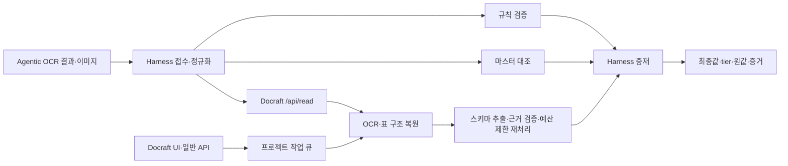

날짜: 2026-10-03  
브랜치: 두 저장소 `docs/architecture-review-20261003` (dev 기반, 평가용)  
워크트리: `harness-v2/.worktrees/architecture-review-20261003`, `Docraft/.worktrees/architecture-review-20261003`  
기록 위치: 상위 작업 공간 wiki — 상위 폴더는 Git 저장소가 아니다.

## 판단

**도메인 기능과 회귀 방어는 강하지만, 운영 신뢰성과 평가 재현성은 추가 보강이 필요한 단계다.** 하네스의 규칙·마스터·판독 증거를 모아 한 곳에서 판정하는 구조, Docraft의 원문 근거 검증과 예산 제한 재처리는 합리적이다. 다만 실제 코드에서 작업 상태 경쟁, 접수 저장 실패 은폐, 외부 URL 접근 경로가 발견됐다. 높은 칸 정확도만으로 고객 운영 안정성과 자동 적재 안전성을 판단하기 어렵다.

평가는 숫자 점수를 임의로 붙이지 않고 코드 근거·재현 여부·과거 실측을 구분했다. 구현 변경과 새 AWS 배포/모델 호출은 하지 않았다. 수정 전 문제 유형을 정의하는 평가이며 신규 제품 회귀 테스트는 추가하지 않았다.

## 기준과 방법

- `git fetch --all --prune` 후 원격 dev와 로컬 dev 일치를 확인했다.
- Harness `5ddf43371d5c871781088ef9efe0b9337d023fab`, Docraft `120feefb6c401ab2dabaf52b9523d42c55aaefc9`를 별도 워크트리에 고정했다. 다른 세션의 미커밋 파일은 제외했다.
- 독립 검토 3개를 병렬 수행: 하네스 코드·테스트, Docraft 코드·테스트·화면 빌드, 성능·정답지·채점 근거.
- 로컬 PostgreSQL을 사용하는 기존 테스트와 합성 입력 재현을 수행했다. SSRF 검증은 네트워크 함수를 가로채 목적지만 기록해 실제 외부 요청 없이 수행했다.
- 정적 줄 수는 주석·빈 줄 포함이다. 긴 함수 중 `create_app`은 라우트 함수들의 컨테이너이므로 888줄 전체를 단일 알고리즘 복잡도로 해석하지 않는다. UI는 물리 줄 수가 작아도 긴 JSX와 다중 문장 때문에 단순하다고 볼 수 없다.

## 아키텍처

| 항목 | Harness v2 | Docraft |
|---|---|---|
| 역할 경계 | 접수→정규화→증거수집→중재→출력·기록으로 비교적 명확 | 파서·추출 엔진·근거·재처리 모듈 분리, 일반 앱과 의료 문서 read/verify 병존 |
| 장점 | 도메인 모델·규칙 YAML·tier·원값 보존, 큐/DB/관측 모듈 분리 | 동일 read 경로 공유, 좌표 근거, 시간·호출 예산, OCR single-flight·동시성 제한 |
| 복잡도 | Python 94파일/31,131줄, engine 1,902줄·runner 1,520줄·API 1,235줄 | backend 18파일/8,479줄, rules 1,935줄·engine 1,010줄·main 945줄; reprocess.run 357줄 |
| 유지보수 위험 | 여러 단계에 도메인 정책이 분산돼 정책 변경 시 정상화·룰·중재·출력 동시 확인 필요 | 짧게 압축한 API/UI 코드와 넓은 재처리 함수가 상태·근거 변경 검토를 어렵게 함 |
| 운영 성숙도 | durable claim·워커 유실 복구·backpressure·별도 readiness 설계는 장점. 접수 저장 실패 경로 보강 필요 | heartbeat·claim·복구가 있지만 작업 세대 소유권 보장이 부족. readiness도 독립되지 않음 |

공통 항목 사전 `receipt_items.yaml`은 이번 두 스냅샷에서 바이트가 동일했다. 각 저장소 복사본을 installer의 빌드 전 비교로 관리하는 방식이다. 이를 중복 버그로 단정하지 않으며, 향후 의미 규칙과 API 계약도 묶인 버전으로 검증하는 것이 좋다.

## 확인한 주요 문제와 일반화 범위

### H1 — 접수에 필수인 저장 실패를 선택적 기록 실패처럼 처리 (높음)

근본 원인: `PostgresJobStore.put`이 `PersistenceRecorder.open_job`을 호출하는데, recorder는 DB 쓰기 실패를 기록하고 예외를 삼킨다. `durable`은 엔진 존재 여부이고 이번 저장 성공 여부가 아니다. API는 `store.put` 이후 큐 전송을 계속한다.

근거: Harness `src/mlife_harness/api/jobs.py:183,190`, `persistence/recorder.py:142–169`, `api/app.py:253–256`. 일시 DB 쓰기 실패 시 접수 응답이 나가더라도 다른 프로세스에서 상태 조회가 불가능해지는 위험이 있다. 후속 상태 저장이 복구해 행을 만들 수 있어 모든 요청이 영구 소실된다고 단정하지 않는다.

문제 유형: **작업 수명주기의 필수 저장과 관측용 best-effort 기록의 실패 정책 혼용**. 접수·종료 저장을 명시적으로 성공 확인하고, DB와 브로커 사이 전달도 outbox/재조정 또는 동등한 보장으로 처리한다. 실패 주입 회귀는 접수 INSERT 실패, enqueue 실패, API 재기동, 조회·콜백 경로를 함께 포함해야 한다.

추가로 SQLite+저장 함수 실패 대역을 사용하는 재현에서 완료 상태 저장 뒤 payload upsert 실패를 넣으면 `put`은 정상 반환했으나 새 store 조회는 `completed/result=null`이 됐다. 근거: `api/jobs.py:199–214`의 분리 쓰기, `recorder.py:321–338`의 실패 은폐. result 조회는 이 상태에서 409를 반환하며, 큐 작업의 `finally`는 spool을 정리한다(`queue/tasks.py:272–273`). **완료 상태와 결과의 원자 저장·저장 확인 후 spool 정리**가 접수 실패 처리와 같은 유형의 우선 수정이다.

### H2 — 임의 callback URL로 서버가 결과를 전송 (높음, 접근 경계에 따라 영향)

근거: Harness `api/app.py:491`의 문자열 입력, `api/jobs.py:528–541`의 `httpx.post(callback_url, json=body)`; body는 최종 결과 전체다. 목적지 허용목록이나 네트워크 주소 제한이 해당 경로에 없다.

문제 유형: **사용자 입력 URL을 서버의 신뢰 네트워크에서 실행**. 인증된 접수 주체가 내부 HTTP 서비스에 POST를 시키거나 허용되지 않은 위치로 결과를 보내게 할 수 있다. 신뢰된 고정 연동만 사용하는 폐쇄망에서는 위험도가 줄지만 코드 경계는 여전히 없다. 콜백 목적지 등록·허용목록과 DNS/IP·리다이렉트 정책을 공통으로 적용한다.

### H3 — 고객 설치 기본 접근 경계와 mTLS의 프록시 전제 (높음, 설정 위험)

Harness Helm 기본값은 `authMode: none`, `service.type: NodePort`, `nodePort: 32444`다(`values.yaml:60–68`). 개발 내부망 기본값이라는 명시적 선택이지만 별도 설정/망 통제 없이 고객 설치에 쓰면 노드 포트에 접근 가능한 주체에게 결과·마스킹 전 증거와 운영 API가 노출된다. 설치 프로파일에 인증과 접근 경계를 필수화해야 한다.

mTLS 모드는 실제 TLS 인증이 아니라 프록시가 넣는 `X-Client-Verified`를 신뢰한다(`api/security.py:280` 부근). 로컬 모의 요청에서 `SUCCESS forged` 헤더만으로 인증 단계가 통과했다. 신뢰 프록시가 외부 헤더를 제거/덮어쓰고 직접 backend 접근을 차단한 환경에서는 사용 가능한 방식이다. 해당 프록시가 없는 배포에서 mTLS 설정만 켜면 보호되지 않는다. 이는 프록시 전제가 충족되지 않은 구성 위험으로 구분한다.

### H4 — 진입 경로마다 구조 계약 검증이 다름 (중간, 로컬 재현)

빈 JSON `{}`은 동기 API 200/tier null, 비동기 API 202 뒤 completed를 반환하지만 배치의 `validate_input`은 transaction_id/documents 누락으로 거부한다. 근거: `api/app.py:248,293`, `pipeline/document_unit.py:115` 부근. 이미지·파일 조건과 구조 계약이 묶여 API가 구조 검사도 생략한다. **공통 입력 구조 계약은 모든 진입 경로에 적용**하고 이미지 필수 여부만 경로별로 분리해야 한다.

### D1 — 재시도와 완료 쓰기에 작업 세대 소유권이 없음 (높음, 로컬 재현)

근거: Docraft `main.py:399–404`는 실행 중인 문서도 queued로 되돌리고, `run_parse`의 완료 UPDATE(`main.py:389`)는 문서 ID만 조건으로 쓴다. claim은 시작 시 상태만 확인한다(`main.py:321–329`).

재현: 첫 parser를 멈춰 둔 상태에서 재분석을 요청하면 202. 새 parser가 NEW를 쓴 뒤 늦은 첫 parser가 OLD로 덮었다. 관련 사례로 재추출 접수 202 후 이전 result를 승인하면 200/completed가 돼 새 워커가 claim에 실패하고 접수된 추출을 건너뛰었다(`mark_queued:556–558`, `approve:620–629`).

문제 유형: **공유 문서 상태를 세대/소유권 조건 없이 갱신**. parse·extract·heartbeat·cancel·approve를 같은 작업 세대 토큰과 조건부 상태 전이로 다루고, 이전 작업의 완료 쓰기를 거부한다. 재시도·오래된 완료·queued 승인·복수 API 프로세스 변형을 회귀에 포함한다.

### D2 — JSON Schema의 외부 $ref 해석이 서버 네트워크 접근으로 이어짐 (높음, 로컬 재현)

근거: Docraft `main.py:435–439`는 스키마 문법만 검사하고 저장한다. `engine.py:868`은 별도 폐쇄 registry 없이 `Draft202012Validator(schema).iter_errors`를 수행한다. 테스트 환경에서 내부 URL의 `$ref` 스키마가 201로 저장되고 validator가 `http://127.0.0.1:12345/internal-schema`를 읽으려는 것을 네트워크 함수 가로채기로 확인했다.

문제 유형은 H2와 동일한 서버 측 목적지 신뢰 부재지만, JSON Schema 참조 해석이라는 다른 진입점이다. 내부 참조만 허용하거나 사전 등록된 schema registry만 사용한다. 원격 문서 취득 여부는 라이브러리 버전 영향도 있으므로 버전 고정과 회귀를 같이 관리한다.

### D3 — CSV/XLSX 내보내기에 문자열이 수식으로 해석됨 (중간, 로컬 재현)

근거: Docraft `main.py:673–684`. 합성 값 `=1+1`이 CSV에 그대로 들어갔고 XLSX에서는 셀 타입 `f`(수식)가 됐다.

문제 유형: **신뢰할 수 없는 문서 문자열을 스프레드시트 실행 문맥에 삽입**. 공유 export 계층에서 값과 헤더를 안전한 텍스트로 내보낸다. 정상 음수 숫자를 보존하면서 `=`, `+`, `-`, `@`, 공백·탭 등 변형 문자열을 검증한다. 악성 수식의 실제 실행은 하지 않았다.

### D4 — readiness와 읽기 동시성 제어의 운영 범위가 제한적 (중간)

Docraft `main.py:193–194` health는 항상 ok를 반환하며 Helm backend의 readiness/liveness 모두 이 경로를 사용한다(`templates/backend.yaml:76–89`). DB·OCR·필수 provider가 준비되지 않은 상황을 별도 readiness로 구분하기 어렵다. liveness에 모든 외부 서비스 상태를 결합하면 재시작 폭풍이 생길 수 있으므로 생존과 서비스 준비를 분리해야 한다.

`latency.py:19–22,83–103`의 OCR semaphore와 캐시는 프로세스 로컬이다. backend/worker 복제 수가 늘면 GPU 전체 동시성은 복제 수에 비례해 늘고 같은 OCR이 중복 실행될 수 있다. `main.py:767–795`는 read 요청 전체를 제한하는 admission gate 없이 스레드로 넘긴다. 프로세스 내 제한을 분산 자원 전체의 제한으로 오인하지 말고 배포 단위 동시성·큐 길이·429/503 정책을 같이 정해야 한다. 이번 검토에서 실제 부하 장애를 재현한 것은 아니다.

### D5 — 일부 페이지 판독 실패를 완전 성공과 구분하기 어려움 (높음, 정적 확인·과거 실측 근거)

Docraft `engine.py:628–641`은 rowmajor와 asis가 모두 실패한 페이지 그룹을 제외하고 성공한 그룹만 병합한다. 실패 수를 `table_pages_failed`로 기록하지만 `/api/read` 응답 지표 목록 `main.py:46`에는 이 값이 없다. 원문 일부를 살려 반환하는 기능 자체는 유용하나 **부분 결과의 완전성 표시가 빠진 것**이 문제다. 문서/페이지별 성공·실패 범위와 partial 상태를 결과·검토 UI·내보내기에 명시하고 자동 승인/적재를 제한해야 한다. 과거 PDF 5건 기록에서 청담 4/6쪽·건국대 1/3쪽만 복원된 사례가 있다. 새 장애 재현은 하지 않았다. 다중 페이지 부분 추출은 주로 일반 프로젝트 PDF 경로의 문제이며 `/api/read`는 단일 페이지 이미지 API이므로 해당 PDF 사례를 하네스 read의 직접 장애로 해석하지 않는다.

### B1 — 재현 가능한 빌드·문서 최신화의 빈틈 (중간)

Harness에는 `uv.lock`이 있으나 `deploy/images/harness.Dockerfile:11–16`은 이를 복사하거나 사용하지 않고 범위 의존성이 있는 프로젝트를 pip install 한다. 잠금 파일이 있어도 이 이미지 빌드 경로에서는 동일 커밋의 의존성이 달라질 수 있다. Docraft는 직접 Python 의존성을 pin하고 frontend lock을 두지만 Python 전이 의존성까지 잠긴 것은 아니다. 현재 테스트 가상환경 결과도 고객 이미지 결과와 동일하다고 보장하지 않는다.

두 평가 스냅샷의 tracked 파일에서는 CI 파이프라인 정의를 찾지 못했다. 별도 GitLab 설정·installer의 검증은 있을 수 있으므로 CI가 전혀 없다고 단정하지 않는다. repo 변경마다 테스트·화면 빌드·공유 사전/계약·차트 검증을 강제하는 근거가 필요하다.

Harness README 첫 표의 테스트 수 1,273건(9/15)과 구현 범위 M6/M7 미착수는 이후 큐/API 구현을 포함한 현재 상태를 대표하기 어렵다. 인수인계 문서의 구현/검증 날짜·기준 커밋을 자동 생성하거나 정기 갱신해야 한다. 이번 평가에서는 제품 문서를 임의 수정하지 않았다.

## 성능과 추출 품질: 수치를 해석하는 범위

| 근거 | 결과 | 해석 범위 |
|---|---|---|
| 10/02 AWS r9, 59건 | 칸 일치 14,489/14,577 = 99.3963%; 내역서 7,583/7,630, 영수증 6,906/6,947 | 당시 배포 커밋·당시 정답 기준. 현재 dev 품질 아님 |
| 같은 r9 문서 단위 | 채점된 칸이 모두 맞은 문서 18/59; tier unresolved 32/repaired 22/pass 5 | 1개 이상 채점 칸을 가진 문서의 정렬 후 칸 완전 일치. 무인 처리 성공률과 다름 |
| 같은 r9 정답 구성 | 정답이 빈 문자열/0인 칸 9,053/14,577 = 62.1%; 나머지 칸 일치 약 99.22% | 빈칸·0도 의미 있는 정답이지만 가중치와 분모를 공개해야 함 |
| 10/03 현재 r9 answer 재채점 | 14,454/14,577 = 99.1562%; 내역서 7,548/7,630 = 98.9253% | 저장 응답을 현 정답/현 scorer로 재채점. 현재 dev 실행 결과 아님 |
| 10/03 Docraft 표만 실험 | 12,820/13,321 = 96.24%; 내역서 6,718/7,201 = 93.29%, 영수증 6,102/6,120 = 99.71% | 게이트·자동 재처리 제외, 내역서 신규 응답 29건+영수증 저장 응답 재적용. 현재 dev 종단 측정 아님 |
| 10/02 r10, 영수증 30건 | 6,907/6,947 = 99.4242% | 영수증 규칙 변경의 좁은 회귀, 7종 문서 전체 보증 아님 |
| 10/02 r8→r9 Docraft 요청 34건 | 실패 3→0, 중앙값 129→86초, p90 185→144초, 최대 278→152초 | 과거 원격 요청 지연. 현재 dev·부하 시 p95/RPS는 미측정 |
| rowmajor 별도 A/B 59건 | 표 칸 89.67→90.27%, 시간 합 2,303→1,001초(-56.5%), 중앙값 36.6→14.3초 | OCR 캐시 고정의 Docraft 1차 표 추출 실험. 하네스 최종 99.4%와 직접 비교 불가 |

정답지 수정 자체를 부적절하다고 판단하지 않는다. [급여 인쇄 정책 결정](2026-10-03-golden-benefit-printed-only.md)에서 실제 인쇄 여부에 따라 r9 정답 359칸을 변경한 것은 명시된 정책 변경이다. 다만 기존 `grade.json`·표·xlsx는 그 변경 뒤 자동 재생성되지 않아 과거 점수와 현재 정답이 같은 폴더에 공존한다. 정답/이미지/응답/채점기/정책의 해시와 버전을 고정하고 재채점 산출물은 새 run 디렉토리에 만드는 것이 우선이다.

59건은 내역서 29·영수증 30이며 다른 의료 문서와 미지 서식의 성능을 대표하지 않는다. 반복해서 개선에 사용한 표본은 최종 holdout이 될 수 없다. 셀은 같은 표·문서 안에서 상관되므로 14,577개를 독립 표본처럼 해석해서도 안 된다. 문서 유형·난이도·기관/서식별 holdout, 금액·날짜·코드의 비빈칸 정확도, 추가/누락 행, 문서 완전 일치, 오교정률, 자동 적재 precision/coverage를 함께 보고해야 한다.

이미 적용된 single-flight, 벽시계 예산, 표 병렬화·분할, rowmajor는 병목과 연결된 개선이다. 다음 최적화는 모델 호출 수·입출력 토큰·OCR 대기·추출/재처리 시간·캐시 hit·최종 품질을 같은 run에서 기록한 뒤 결정해야 한다. 현 근거로 처리량 목표 달성이나 확장 효율을 선언할 수 없다.

## 검증과 한계

- Docraft 기존 테스트: **848 passed, 7 warnings, 10.11초**. 로컬 DB 연결이 가능한 실행에서 확인했다. 모델은 테스트 대역/로컬 경로이며 실물 추론 품질을 검증하는 결과가 아니다.
- Docraft frontend: 복사한 동일 소스를 `/tmp`에서 기존 의존성으로 `npm run build` 실행, TypeScript+Vite 성공. JS 597.61 kB(gzip 183.99 kB), PDF worker 1,375.84 kB. 500 kB chunk 경고가 있었으며 초기 로딩 분할은 검토 대상이다. 브라우저 상호작용/실기기 테스트는 새로 하지 않았다.
- Docraft 별도 합성 재현: 오래된 완료 덮어쓰기, queued 결과 승인으로 작업 건너뛰기, schema 외부 참조, CSV/XLSX 수식 해석을 확인했다. 기존 848개가 통과해도 이 유형이 방어된다는 뜻은 아니다.
- **Harness 기존 테스트: 1,920 passed, 2 skipped, 8 deselected, 2 warnings, 56.69초**. 첫 sandbox 실행이 정체돼 중단한 후 네트워크/로컬 서비스 접근이 가능한 환경에서 bounded 재실행했다. 기본 pytest는 slow 마스터 전량 테스트를 제외한다. 건너뛴 테스트와 slow 8개는 통과 수에 포함하지 않는다. `tests/conftest.py`의 공통 fixture가 필수키 목록을 비우므로 모든 실제 필수키 설정의 종단 검증을 뜻하지 않는다.
- 새 AWS 배포·실물 모델·고객 폐쇄망·장시간 부하·장애 주입 전체 실험은 수행하지 않았다. 추론 비용을 발생시키는 검증은 배포 담당 취합 흐름을 따라야 한다.

## 개선 순서

1. **운영 데이터 무결성·접근 경계**: 부분 페이지 추출의 완전성 표시와 자동 적재 제한, Docraft 작업 세대 조건부 쓰기/승인 상태 제한, Harness 필수 저장 실패 전파, callback과 schema ref 목적지 제한, CSV/XLSX 안전한 텍스트 출력.
2. **평가를 재현 가능한 출시 게이트로 만들기**: 정책·gold·scorer·모델·커밋 해시 고정, 과거 run 불변, 별도 holdout. 자동 적재 오교정/precision과 문서 성공률을 칸 정확도와 함께 보고.
3. **부하 시 지연·복구 검증**: API admission, GPU 전체 동시성, readiness 분리. 동시 요청 증가·DB/브로커 장애·worker 종료·복제 수 변화에서 p50/p95/p99·처리량·유실/중복·비용 기록.
4. **구조 정리**: 룰/정규화/중재의 정책 소유권 명시, reprocess 루프의 선택·실행·수용 경계 분리, 긴 JSX/다중 문장 가독성 개선. 비슷한 기능을 새 추상화로 더 만들지 말고 실제 같은 정책을 소유하는 모듈만 정리.
5. **출시 재현성**: lock을 실제 이미지 빌드에 사용, 테스트 환경과 런타임 의존성 대조, 계약/공유 규칙/차트 검증의 CI 강제 여부 확인, README 검증일과 구현 상태 갱신.

## 근거와 재현 자료

- 코드 기준: 위 두 dev SHA와 평가 워크트리. 코드 줄 번호는 해당 고정 SHA 기준이다.
- [AWS r9 지연·정확도 기록](2026-10-02-aws-integrated-deploy-1002i.md), [r10 영수증 기록](2026-10-02-aws-integrated-deploy-1002j.md).
- [rowmajor A/B 보고서](2026-10-02-table-rowmajor-report.md), [급여 인쇄 정책과 정답 변경](2026-10-03-golden-benefit-printed-only.md).
- 로컬 검증·합성 재현·재채점 해시는 `2026-10-03-harness-docraft-review-evidence/`에 보존한다.

### 재채점 지표 정의

채점기는 `e2e/grade_samples.py`의 `walk`, `tally`, `grade_file`, `verdict`와 `e2e/make_report.py`의 `judge`, `align_rows`다. 금액 빈칸/0과 날짜·명칭을 정규화하며 null·마스킹 칸은 제외한다. 문서 완전 일치는 구조·메타데이터까지 원본 JSON이 동일하다는 뜻이 아니라 **정렬된 채점 칸이 1개 이상이고 그 칸이 전부 일치함**을 뜻한다. 역사적 r9는 18/59, 오늘 정답 재채점은 16/59다. 역사적 r9의 0칸 문서까지 포함하면 19가 되어 이를 제외했다. `unresolved` tier 역시 셀 오답과 같은 정의가 아니다.

현재 표 실험의 96.24%는 정답 정책과 분모가 달라 초기 90.27%와 직접 비교하지 않는다. 현재 `TABLE_REREAD_GATE` 기본 0.6은 초기 실험의 0.3과도 다르다. Docraft PDF 페이지 분할 개선과 별개로 하네스의 재판독 adapter는 다중 페이지 문서를 제외하므로 Docraft 직접 PDF 실험을 하네스 종단 성능으로 주장하지 않는다(`reread/docraft.py:301`).
